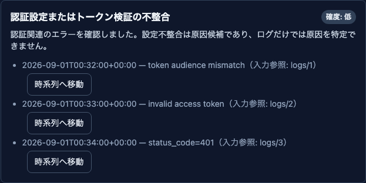
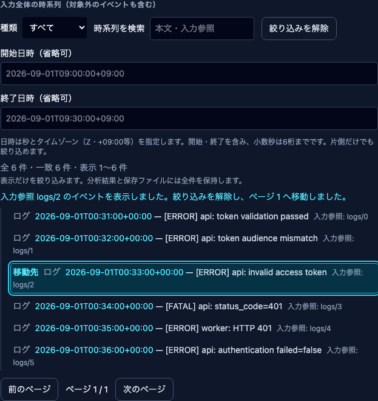
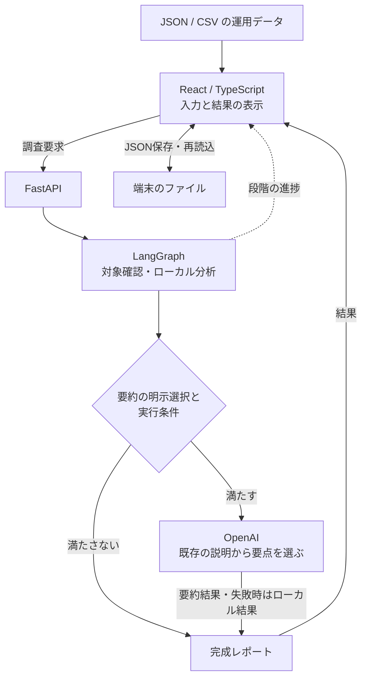

# AI Incident Investigator

**ログ・メトリクス・デプロイ履歴から、根拠をたどれる調査レポートを作る。**

運用データを時系列で照合し、観測事実、未確定の原因候補、次に確認することを整理するローカルの障害調査支援ツールです。候補の根拠から入力イベントへ移動でき、保存した結果を開き直しても同じ根拠を確認できます。

| 項目 | 内容 |
| --- | --- |
| 開発形態 | Codexによる実装・テスト・レビュー支援を活用した個人開発 |
| 現在の範囲 | ローカルで動作するMVP。JSON/CSVを入力して調査 |
| 技術 | React / TypeScript / Vite、FastAPI / Python、LangGraph、OpenAI API（任意） |
| 検証 | pytest、Vitest、Playwright、GitHub Actions |
| 公開するもの | 機能紹介、設計判断、構成図、合成データの画面、検証と学び |

## 解決したい課題

障害調査では、ログに出たエラー、メトリクスの変化、直前のデプロイを並べても、それだけで原因を確定できません。「何が起きたか」「何が原因候補か」「どの記録を根拠にしたか」を分けて確認する必要があります。

そこで、**人が判断を確かめられること**を設計の中心に置きました。対象サービスと発生時刻を確認し、その前後30分のデータを分析します。条件が不足する場合は情報不足を示し、対象外を含む入力全件の時系列を残します。

## 画面でたどる、約2〜3分のデモ

以下はすべて合成データです。サービス名やログ文は架空のもので、実障害の正解率を示すデモではありません。画像は2026-09-07に、1440px幅のChromiumで撮影しました。

### 1. 原因候補と観測事実を分ける

認証失敗の合成ケースを調査すると、認証設定またはトークン検証の不整合が、確度の低い候補として表示されます。候補の根拠は失敗を示す3件で、成功や否定を示すログは含めません。

この入力にはログが6件あり、対象サービスの範囲内は5件です。「ERROR/FATALレベルのログが5件ある」という観測と、「認証失敗候補の根拠に使う3件」は意味が異なります。

### 2. 隠れている根拠へ移動する

時系列を検索で絞り込み、候補の根拠イベントが見えない状態にします。そこで候補内の「時系列へ移動」を押すと、絞り込みを解除して該当行へフォーカスします。ページ送りで隠れたイベントにも到達できます。

`logs/2`は、その入力のログ配列にある3件目を示します。同じ時刻・同じ本文でも、配列内の位置が異なれば区別します。別の調査にある同じ番号と、同一イベントだとみなすことはしません。

### 3. 絞り込み中に保存し、開き直す

画面を1件に絞り込んでも、JSON・Markdown保存と印刷はレポート全件が対象です。このケースでは6件の時系列を保存します。JSONを開き直すと、再分析せずに結果と根拠を再表示できます。

保存結果と現在の入力欄は別に扱います。形式・分析版、件数、処理記録、根拠の参照先を検証し、古い形式や不整合なファイルは表示しません。このデモではOpenAIを呼び出していません。

## 構成と処理の流れ

LangGraphは、時系列整理、対象・時刻の確認、根拠の分析、ローカル結果の作成、要約、レポート完成の6段階を記録します。画面では実行中の進捗と中断を扱い、未完成の結果を保存済みレポートとして扱いません。

## 設計で重視したこと

### 根拠を入力に結び付ける

原因候補、観測事実、時系列に共通の入力参照を持たせました。時刻や本文だけで照合すると重複を区別できないため、入力内の種類と配列位置で対応付けています。参照の有効範囲をその入力と結果に限定し、画面・API・保存後の再表示で同じ契約を使います。

### AIに渡す役割を限定する

原因候補と根拠はローカル分析で作ります。OpenAIは調査ごとの明示選択と条件を満たした場合に、既に得られた観測事実や候補の説明から要点を選ぶ用途に使います。返された選択を検証し、既存の文を表示する抽出方式です。

生ログや入力全体は送信しません。選択対象の説明にはサービス名・メトリクス名や値を含む場合があるため、外部送信が可能なデータか確認して選択する設計です。要約の失敗や省略でも、ローカルの候補・根拠を保持します。

### 入力・表示状態・保存結果を混同しない

入力の編集や別ファイルへの切り替えでは、古い結果とOpenAIの選択を解除します。遅れて届いた以前の応答で、新しい入力の結果を上書きしません。時系列の検索やページ送りは表示だけの操作とし、保存・印刷する全件レポートに影響させません。

保存JSONには形式版と分析版を持たせ、再読込時に構造と参照の整合性を確認します。ブラウザ保持は利用者が選んだ完成レポート1件だけとし、自動保存はしません。保持データの消去と、表示中の結果の解除も別の操作にしています。

## 検証したこと

2026-09-07に紹介対象の実装と、2026-09-06に成功した同じ実装のCIログを照合しました。

| 検証 | 結果・対象 |
| --- | --- |
| Backend | 494テスト成功。分析、API入力検証、処理分岐・中断など |
| Frontend | 522テスト成功。入力・状態遷移・保存形式・根拠参照など |
| Chromium E2E | 80テスト成功。実ローカルAPIと画面の操作を組み合わせて検証 |
| 型チェック・ビルド | 成功 |
| シナリオ評価 | 27の合成シナリオ。Backendテストの内数 |
| 今回の撮影手順 | 2026-09-07に調査→根拠移動→全件保存→再読込→入力修正を確認 |

E2Eでは375px・1440pxの画面幅を含む複合操作を検証しています。例えば、同時刻・同内容の重複イベントへの移動、入力エラーからの修正と再実行、絞り込み中の全件保存、保存結果の比較、ブラウザ保持後の再表示です。一部のエラーや途中応答はモックで再現しています。通常CIと今回の撮影では、実OpenAI APIを呼びません。

テスト件数は検証範囲を表すもので、実障害での正解率・網羅性・性能を保証しません。実運用データによる精度評価、第三者によるユーザビリティ評価、Chromium以外のブラウザ、実スクリーンリーダーは未検証です。

## 開発で学んだこと

- **正しい分析と、確かめられる分析は別の課題がある。** 根拠の参照、重複時の扱い、画面からの移動、保存後の検証まで揃えることで、判断を確認する手順を作れました。
- **単独機能が動くだけでは操作全体を保証できない。** 入力編集、非同期応答、検索、保存を組み合わせると状態の取り違えが起きるため、複合操作を通常CIへ組み込みました。
- **保存はデータの責任範囲を増やす。** 自動保持にせず明示操作を設け、容量不足・保存拒否・破損を扱い、消去方法と復元結果の出所を示しました。

## 担当とAI支援

個人プロジェクトとして、作りたい機能、改善の優先順位、公開する範囲を決め、Codexへ実装・テスト・レビュー・修正を依頼しながら開発しました。Issue・PRで完了条件と検証結果を記録し、指摘や失敗があれば修正して再検証する進め方です。

本記事のレビューにはAI支援による確認を含みます。第三者レビューの承認や実運用への導入実績は、ここで示す検証実績には含めていません。

## 現在の範囲と今後

入力ファイルを使うローカルMVPとして、根拠確認、入力修正、メトリクスのプレビュー、保存・再読込・比較まで実装しています。DB、ユーザーログイン、外部監視サービスとの接続、本番デプロイは現在の対象外です。

今後の候補は、比較結果の保存やログ・デプロイの入力プレビューです。実装コードは非公開で管理し、このページでは公開用の説明と合成データの画面を紹介します。

[ポートフォリオの一覧へ戻る](../../README.md)
