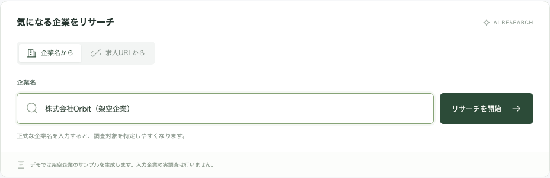
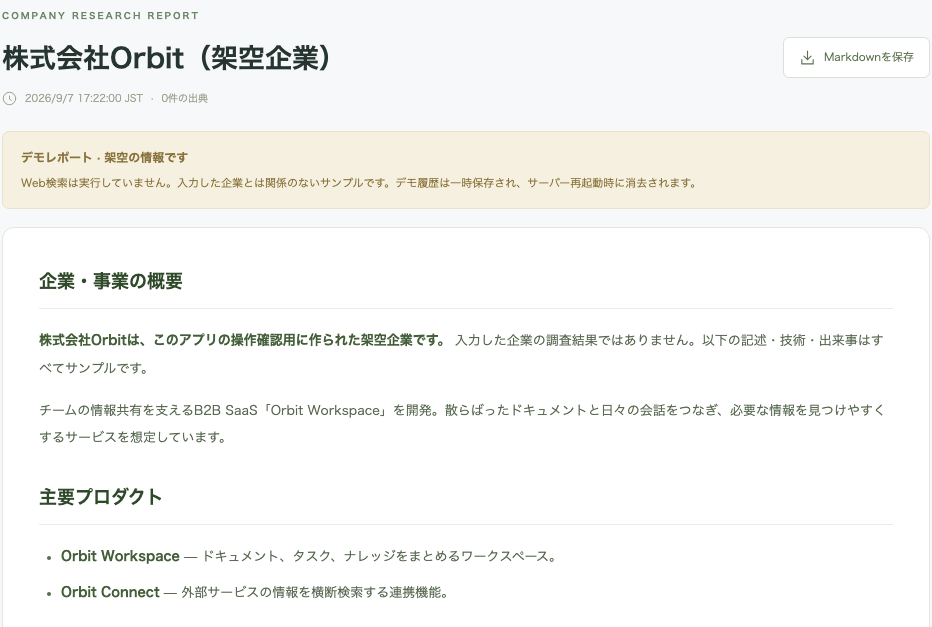
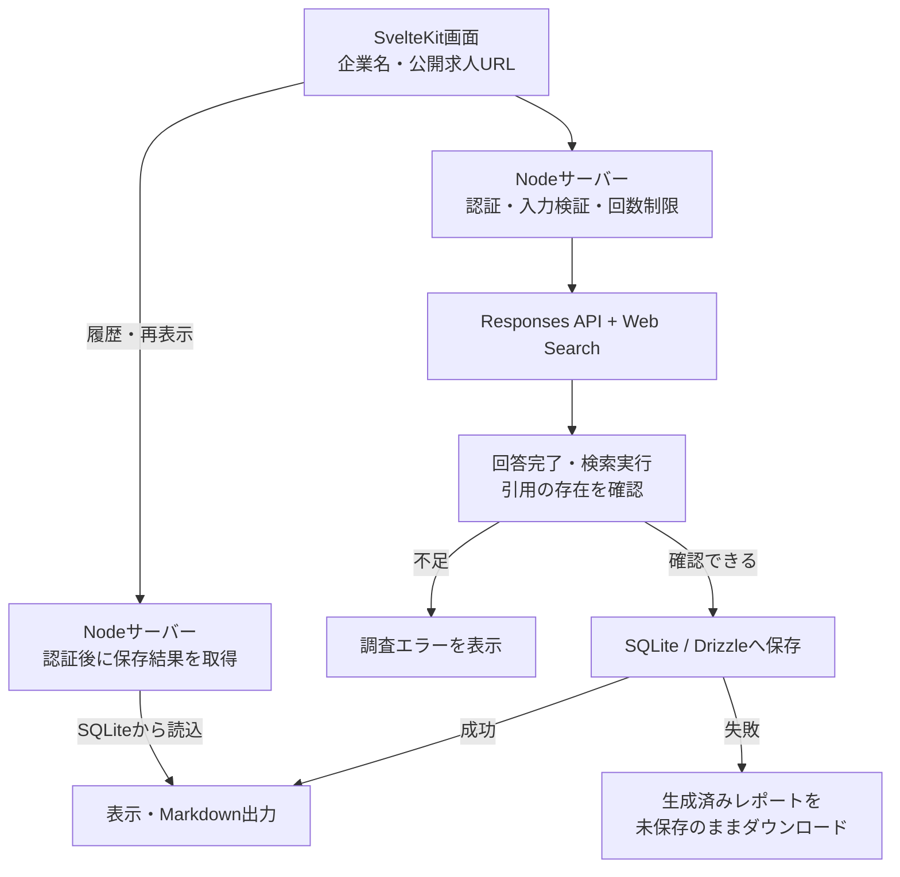

# Career Research Agent

**個人用の企業研究ツールで、構成の簡略化、有料APIの制御、生成結果の検証に取り組む。**

企業名や公開求人URLから、事業・プロダクト・技術・直近の動向を調べ、出典リンク付きの日本語レポートを作るローカルWebアプリです。生成結果を保存し、履歴から開き直してMarkdownで持ち出せます。

| 項目 | 内容 |
| --- | --- |
| 開発形態 | Codexによる実装・テスト・レビュー支援を活用した個人開発 |
| 現在の範囲 | 個人用のローカルMVP。共有パスワードで実調査を保護 |
| 技術 | SvelteKit / TypeScript / Tailwind CSS、Node、SQLite / Drizzle、OpenAI Responses API / Web Search |
| 検証 | Vitest、Playwright、実SQLite、GitHub Actions、少数の実API検証 |
| 公開するもの | 設計判断、構成図、架空データの画面、検証と学び |

## 解決したい課題

応募前の企業研究では、求人票、企業サイト、技術ブログなどを読み、情報の根拠と面談で確認したい点を整理する必要があります。その下調べを、後から読み返せるレポートとして残すことを目指しました。

個人が自分のPCで使う範囲に絞り、外部DBの設定を減らすこと、有料APIの呼び出しを制限すること、生成した結果を保存失敗で失わないことを重視しています。調査時間の短縮量や、応募判断への有効性はまだ測定していません。

## 画面で見る操作の流れ

以下は2026-09-07に、1440px幅のChromiumで撮影したデモモードの画面です。企業・製品・技術情報はすべて架空です。撮影時はWeb検索も実DBへの保存も行わず、デモ履歴をサーバーのメモリに一時保持します。

### 1. 調査対象を入力する

企業名と公開求人URLを切り替えて入力できます。この画面では架空の企業名を入力しています。デモでは入力にかかわらず固定のサンプルを表示し、実調査とは区別して案内します。

### 2. レポートを読み、履歴から再表示する

レポートは6節に分かれ、企業概要から技術情報、面談での質問、未確認事項までを整理します。画像はその上部です。撮影時には生成後のMarkdown出力、履歴からの再表示、ページ再読み込みも確認しました。

デモに出典はありません。実調査では本文の番号付き引用と出典一覧を表示し、SQLiteに保存します。実調査の保存結果はNodeを再起動しても残り、再表示・ダウンロードではAIを再実行しません。

## 実調査の構成

図は実調査の経路です。サーバーからOpenAIへ入力内容を送ります。外部DBは使わず、生成結果・入力・出典・作成時刻はローカルに保存します。デモはAIとSQLiteを使わない別の経路です。

## 設計で重視したこと

### 個人利用に合わせて構成を簡略化する

当初のSupabase / PostgreSQL・Vercelを前提とした構成から、SQLiteとローカルNodeへ変更しました。個人利用では、外部DBの契約や接続情報の管理を減らせる構成が適していると判断したためです。必要なDBファイルとテーブルは初回アクセスで自動作成します。

この判断に伴い、永続ディスクを持つ単一Node環境を前提にしました。SQLiteの同期ドライバーはロック待ち中に同じプロセスの処理も止めるため、待機を最大5秒に制限しています。複数インスタンスでの運用は対象外です。Drizzleを使っても、別DBへの移行にはドライバー・スキーマ・データ変換の作業が必要です。

### 有料APIの呼び出しと保存失敗を分けて扱う

1レポートにつきResponses APIへ1回リクエストし、自動リトライは行いません。検索・ページ閲覧の組み込みツール呼び出しは既定3回、変更可能範囲を1〜10回に制限しました。通信時間と出力トークン数にも上限を設けています。これらは請求額を固定するものではありません。

生成後にDB保存が失敗した場合は、完成した内容を画面へ返し、未保存レポートとしてダウンロードできるようにしました。保存の問題で調査を最初からやり直す必要を減らす設計です。実SQLiteを意図的にロックする統合テストで、この復旧経路を確認しました。

実調査は共有パスワードで保護し、変更要求の送信元と入力を検証します。個別アカウントはなく、同じパスワードの利用者は履歴を共有します。

### 引用があることと、主張が裏付けられることを区別する

サーバーでは回答の完了、完了した検索の存在、有効な引用を確認します。本文中で引用範囲が重なる場合も参照元を残し、リンクをたどれる形に変換します。

実応答を出典と照合すると、一部の文で引用先が主張全体を裏付けていないことが分かりました。新旧を十分に比較していない資料を「最新」と表現する課題もありました。そこで、根拠が異なる主張には別々の引用を付け、最新性を確認できない情報を断定しないよう調査指示を補強しました。

この最終補強後の実生成は、追加課金を抑えるため再検証していません。修正したことと、生成品質の改善を確認できたことを分けて記録しています。

## 検証と現在の限界

2026-09-07に、紹介対象の実装と同日に成功したCIログを照合しました。

| 検証 | 結果・条件 |
| --- | --- |
| Vitest | 63件成功。入力、認証、引用処理、設定境界、保存など |
| デモE2E | 12件成功。デスクトップ・モバイルの操作 |
| Node / SQLite統合 | 8件成功。ローカルの模擬AI応答を使い、SDKのHTTP通信、保存、DBロック、再起動を検証 |
| 型チェック・ビルド・整形 | 成功 |
| 既存の実API検証 | 企業名1例・公式求人URL1例。各1リクエスト。最終の指示補強前に実施 |
| 今回の撮影 | デモの生成・履歴・再表示・Markdown出力を確認。実API呼び出しなし |

自動テストは合計83件で、上の3種類の内訳を合算したものです。通常CIは課金APIを呼びません。求人URLの実検証では、検索・閲覧上限3回の条件で、約11.8秒で6節・出典3件のレポートを生成し、保存と再起動後の再表示を確認しました。これは1回の観測値で、性能保証や調査精度の指標ではありません。

求人の職種・技術情報やニュースの発表日について主要な記述を出典と照合しましたが、一部の引用不足が残りました。少数の検証であり、求人サイト全般の精度、実利用による時間短縮、第三者による使いやすさの評価は未確認です。給与・勤務地・働き方の整理や、業績・競合を含む調査の深さにも改善余地があります。

## 開発で学んだことと担当範囲

- **用途を絞ると、選ぶ構成も変わる。** 個人利用を優先したことで、外部DBの管理を省き、永続化と認証を保つ構成へ整理できました。
- **生成の成功と保存の成功は別に扱う必要がある。** 有料処理で得た結果を保持しておけば、保存失敗からの復旧手段を用意できます。
- **アプリの回帰テストと生成内容の評価は別に必要になる。** 引用形式を検証するテストだけでは、出典と文章の意味が一致するかを確認できませんでした。

個人プロジェクトとして、目的、簡略化の方針、検証費用を抑える方針、掲載範囲を決め、Codexへ実装・テスト・レビュー・修正を依頼して開発しました。実装案の具体化や検証、本文・出典の照合にもAI支援を使っています。第三者レビューの承認や、実運用への導入成果を主張するものではありません。

実装コードは非公開で管理しています。今後の候補は、複数求人で使う評価ケースの整備、募集条件の整理、削除・バックアップの改善です。

[ポートフォリオの一覧へ戻る](../../README.md)
