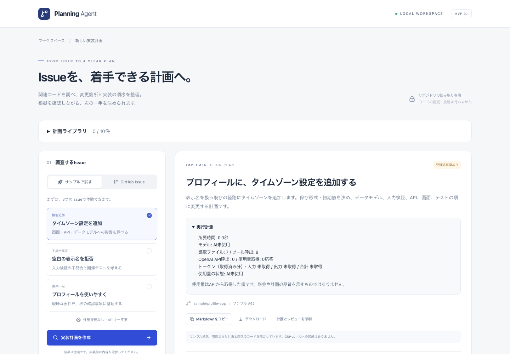
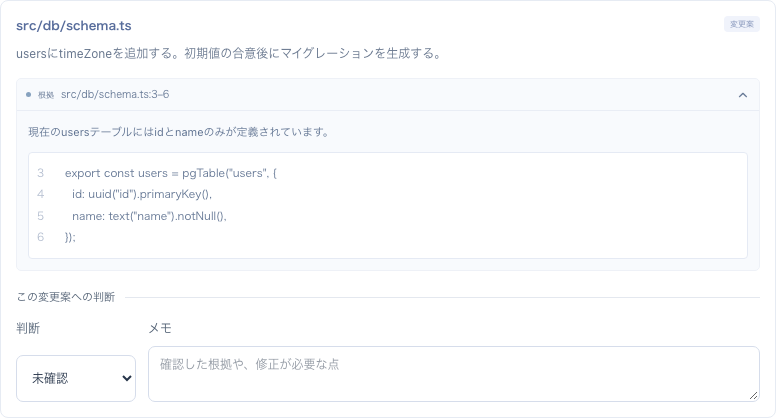
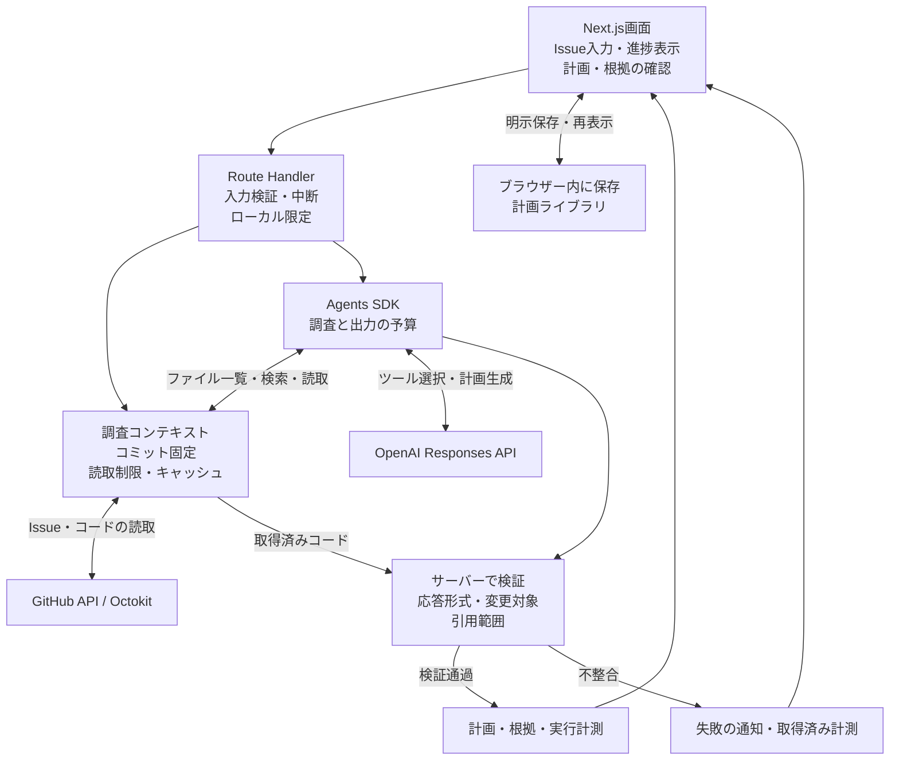

# GitHub Planning Agent

**調べたコードと引用を照合し、AI調査の回数・時間を制御する。**

GitHub Issueと関連コードを調べ、変更対象・実装手順・テスト計画を根拠付きで提案することを目指した、個人開発の技術検証プロトタイプです。計画を確認する画面、引用の検証、保存・再表示・比較、失敗時の計測まで実装しました。

実GitHubとOpenAIへの接続は確認していますが、**実Issueから検証を通る計画を完成させ、有用性を確認するところまでは到達していません。** このページでは、現在の実装と、実評価の失敗から得た設計上の学びを紹介します。

| 項目 | 内容 |
| --- | --- |
| 開発形態 | Codexの実装・テスト・レビュー支援を活用した個人開発 |
| 現在の範囲 | ローカルで使う技術検証プロトタイプ。追加開発・実評価はいったん区切り |
| 技術 | Next.js App Router / Route Handlers、TypeScript、OpenAI Agents SDK / Responses API、Octokit、Tailwind CSS |
| GitHub認証 | GitHub App、またはローカル検証用のfine-grained PAT |
| 保存 | ブラウザーのlocalStorage、JSON・Markdown出力 |
| 検証 | Vitest、Playwright、GitHub Actions、回数を制限した実API評価 |
| 公開するもの | 設計判断、構成図、合成サンプルの画面、検証結果と限界 |

## 解決したい課題

Issueの文章だけでは、変更が画面・API・データ型・テストのどこまで及ぶか分かりません。既存コードを読み、変更候補と実装順序を整理する作業を支援したいと考えました。

目指したのは、提案の根拠を開発者が確認し、採用・修正・見送りを判断できる計画です。コードの自動変更やGitHubへの投稿は対象にせず、読取専用の調査と人による確認に範囲を絞っています。

対象は、あらかじめ設定した1つの小規模なTypeScript / Next.jsリポジトリです。Issueのタイトルと本文を読み、関連ファイルを選んで調査します。Issueのコメント、PR、リポジトリ全体の意味解析は対象外です。

## サンプルで見る操作の流れ

以下は2026-09-11に、1440px幅のChromiumで撮影した画面です。**用意された計画と架空のコードを使うサンプルで、AIがその場で生成した計画ではありません。** 撮影時は認証情報を空にし、GitHub・OpenAIへの接続を行っていません。

### 1. 要件と計画の概要を確認する

機能追加・不具合修正・要件不足の3つのサンプルを用意しています。画像は「プロフィールにタイムゾーンを追加する」ケースです。変更候補、テスト観点、未確定事項を整理し、実行計測にはAI未使用・API呼出0回と表示します。

### 2. 変更候補の根拠を開き、判断を記録する

変更候補には根拠のファイル名・行範囲・コード抜粋を付けます。画像内のコードも公開用の合成サンプルです。各候補に判断とメモを付け、計画全体の評価も残せます。

撮影時には、根拠の展開、メモ入力、明示的な保存、ページ再読込後の再表示、Markdown出力を確認しました。保存結果を開く操作では再調査せず、保存済みデータであることを表示します。

## 実調査の構成

図は実調査の経路です。サンプルはGitHubとOpenAIを使わず、用意されたデータを同じ引用検証・表示処理へ渡します。

実調査ではIssue本文と取得したコードをOpenAIへ送信します。認証情報はサーバー側で使い、SDKのトレースとResponses APIの保存指定を無効にしています。これは外部へのデータ送信そのものをなくす設定ではありません。

## 設計で重視したこと

### 調査したコードと引用を対応付ける

開始時に対象コミットを固定し、途中でブランチが更新されても、調査と引用の対象が変わらないようにしました。引用本文とリンクは、サーバーが取得済みコードと固定コミットから作ります。

既存ファイルの変更には、そのファイル自身の根拠行を必須とします。実評価でこの根拠が欠けた変更案を拒否したことを受け、モデルの出力形式でも「変更先内の根拠」と「補足の根拠」を分けました。行や理由をサーバーで埋め合わせることはせず、未読ファイルや不正な行範囲は失敗として扱います。

この検証で確認できるのは、引用先の存在や取得したコードとの対応です。その行が提案を意味的に裏付けるかは、別途レビューが必要です。また、固定するのはコードであり、Issue本文は各実行時に取得します。同じコミットを指定しても、AI出力の再現性までは保証しません。

### 調査と最終出力の両方に予算を設ける

調査は最大18ファイル、合計160,000バイト、ツール28回、モデル12ターン、全体90秒に制限しました。最後の1ターンを計画出力に残します。45秒経過またはツール28回に達した場合も、次のモデル要求を出力専用に切り替え、追加の調査ツールを停止します。1回のモデル要求にも45秒の期限を設けていますが、残時間内の計画完成を保証するものではありません。

検索先にディレクトリを指定するような訂正可能な誤りには、合計2回まで訂正方法を返します。誤指定も呼出上限に含め、無制限の再試行を防ぎます。取得失敗・時間切れ・未完了応答を完成した計画として表示しません。

既定のgpt-5-miniでは推論量・文章量をlow、**1回のモデル要求の出力上限を、推論込みで4,000トークン**に調整しました。1つの計画を作るまでに複数の要求を行うため、全体の使用量は各要求で取得できた分を合算します。全応答取得・一部取得・未取得を区別し、回数やトークンの上限を課金額の保証として扱いません。

### 計画と、人が付けた判断を分けて保存する

候補への判断や評価メモは、生成された計画と別のデータとして扱います。レビューを付けても、自動検証の結果や実行計測は変わりません。

保存は利用者の明示操作とし、再読込時には形式と根拠参照の整合性を検証します。保存した計画の比較、JSONの入出力、評価CSV、印刷も用意しました。画面の絞り込みが保存・出力対象を意図せず減らさないことをテストしています。

個人のローカル利用に合わせ、共有DBやアカウントを導入せず、ブラウザー内の保存を選びました。保存データにはIssue本文と引用コードを含み、端末間の自動同期やアプリ独自の暗号化は提供しません。再表示時の検証も保存データ内の整合性が対象で、GitHubの現在のコードとは再照合しません。

## 検証と到達点

2026-09-11に、紹介対象の実装と同日に成功したmainのCIを照合しました。

| 検証 | 結果・対象 |
| --- | --- |
| Vitest | 239件成功。入力、調査制限、SDKとHTTPモック、引用、保存形式、通信など |
| Chromium E2E | 20件成功。サンプル操作、保存・再表示・比較、エラー表示など |
| lint・型検査・本番ビルド・整形 | 成功 |
| 今回の撮影 | 合成サンプルの根拠確認・保存・再表示・Markdown出力。実API呼出なし |

通常CIは実GitHub・OpenAIを呼びません。自動テストの成功は、実Issueでの計画生成の成功率や有用性を示すものではありません。

実APIの評価では、入力誤りからの回復、調査ターンを使い切る問題、最終要求の時間切れ、変更先自身の引用不足が順に課題となりました。最新の実評価は2026-09-08、PATとgpt-5-miniで1件の実Issueを調査したものです。

| 最新の実評価 | 観測結果 |
| --- | --- |
| 全体 / 最終モデル要求 | 約68.9秒 / 約38.1秒 |
| 読取 / モデル要求 | 9ファイル / 12要求 |
| 取得済み使用量 | 入力96,807・出力3,521、合計100,328トークン。全12応答から取得 |
| 最終結果 | APIの応答は完了したが、変更先自身の引用がなく検証で停止。計画は表示されなかった |

使用量は12要求の合計で、入力には各要求へ渡した指示・調査履歴などを含みます。読んだコードの量や、1回の入力サイズを表す値ではありません。1回の観測から、時間短縮の効果や一般的な成功率は判断できません。

この評価では生成文を保存していなかったため、根拠が欠けた具体的な変更候補は特定できませんでした。その後、変更先の根拠を必須にする出力形式と、失敗候補を識別するための診断情報を追加し、合成した失敗例をモックで検証しました。**当時の生成文そのものを再現した検証ではなく、最終修正後の実生成と、計画の意味的品質は未検証です。**

## 学びと開発の区切り

- 調査ツールを増やすだけでは、予算内に計画を返せませんでした。最終出力の時間とターンを明示的に残す必要がありました。
- 「変更先自身を引用する」という文章の指示だけでは欠落が起きました。出力形式とサーバー検証の両方で要求を表す設計へ修正しました。
- APIのHTTP成功、応答の完了、引用検証の通過、計画の有用性を、それぞれ別に記録する必要がありました。

追加開発と実API評価はいったん区切り、未達成事項を残して紹介資料にまとめました。実用性の確認、複数種類の実Issueでの評価、失敗情報のJSONダウンロードは未完了です。DBによる共有履歴、利用者認証、本番公開、複数リポジトリ対応も実装範囲に含みません。

## 担当とAI支援

個人プロジェクトとして、目的、ローカル利用の範囲、PATで試す方針、実APIの呼出回数を制限する方針、開発を区切る時点と掲載範囲を決めました。具体的な実装・テスト・レビュー・修正、評価記録の整理、この記事の作成にはCodexの支援を使っています。

レビューにはAI支援による確認を含みます。第三者レビューや実運用による有効性の評価は未実施です。実装コードは非公開で管理し、このページでは紹介資料と合成サンプルの画面を公開しています。

[ポートフォリオの一覧へ戻る](../../README.md)
