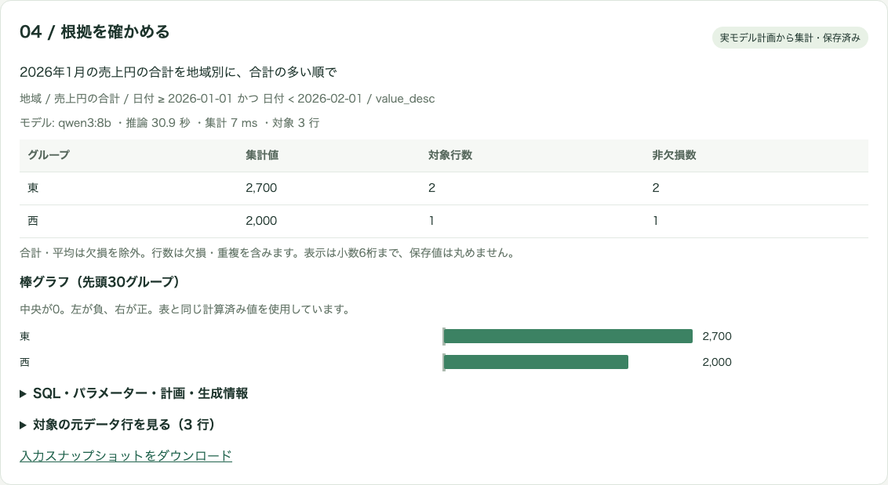
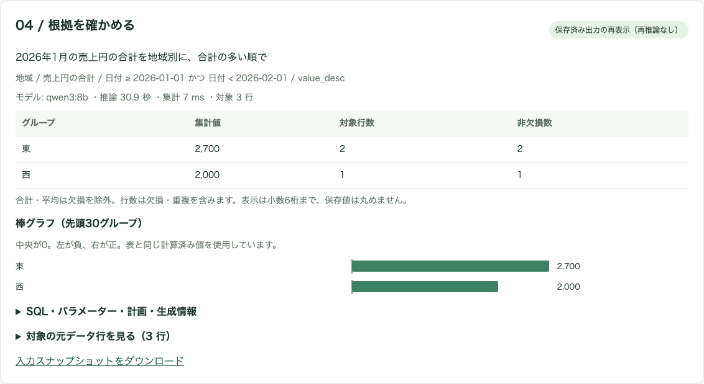

# Local Data Workbench

**日本語で質問し、集計条件と元の行まで確かめるローカルCSV分析。**

小さなCSVを読み込み、端末内のLLMが日本語の質問を分析計画へ変換するアプリです。利用者が計画を確認・修正してからDuckDBで計算し、表・棒グラフ・対象行を表示します。入力と結果を保存し、次回は推論せず開き直せます。

**2026年10月3日：技術プロトタイプとして今回の開発を終了。** 実モデルで主要操作を確認し、改善と失敗を記録しました。本人・第三者による有用性評価は未実施で、業務の時間短縮や日本語質問全般の精度を実証したものではありません。実装コードは非公開とし、ここでは合成データの画面と設計・検証結果を紹介します。

## 解決したい課題

CSVの集計では、計算式が正しくても、列・期間・欠損の解釈が違えば答えが変わります。LLMに答えの数値まで生成させると、計算の根拠を追うことも難しくなります。

そこで、LLMには質問の解釈と確認事項の提示を任せ、数値計算はDuckDBに限定しました。生成した計画を人が確認する段階を設け、集計結果から条件・SQL・元行へ戻れるようにしています。CSVをクラウドへ送る経路やクラウドモデルへのフォールバックは設けていません。

## 操作の流れと実画面

1. UTF-8 CSVを1ファイル読み込み、列名・型・欠損数と先頭行を確認する。
2. 日本語で質問し、ローカルモデルが分析計画または確認質問を返す。
3. 対象列・演算・絞り込み・グループ・並び順を確認・修正し、確認チェックを付ける。
4. DuckDBで実行し、表・棒グラフ・対象行・SQLとパラメーターを確認する。
5. 入力スナップショット、質問、生成計画、編集後の計画、SQL、結果を保存し、履歴から再表示する。

次の画像は、公開用の合成CSVについて**実モデルが生成した計画を確認し、集計・保存した直後**の画面です。「2026年1月の売上円の合計を地域別に、合計の多い順で」という質問に対し、1月1日以上・2月1日未満の3行を集計しています。モックではなく、出力や数値も差し替えていません。

次は**Ollamaを停止し、アプリを再起動してから保存結果を開き直した画面**です。表示している推論時間は保存された元の生成情報であり、撮影時の新しい推論ではありません。再表示時のモデルへのリクエストは0件でした。

## 構成と技術選定

| 段階・技術 | 役割と選定理由 |
| --- | --- |
| SvelteKit / TypeScript / adapter-node / Tailwind CSS | ローカルWeb画面とAPIを一つのアプリで管理。Node上でネイティブDBクライアントを利用する。 |
| Ollama公式JavaScriptクライアント / qwen3:8b | 端末内で質問を解釈する。受付判定だけ思考モードとし、計画生成は非思考モードに分離した。 |
| Zod / JSON Schema | 許可した演算だけのJSON計画を生成・検証。実在する列IDと型を照合し、利用者の確認へ進める。 |
| DuckDB公式Node Neoクライアント | 検証済み計画からアプリがSQLを組み立て、値をパラメーターで渡す。計算済みの同じ値を表・グラフに使う。 |
| SQLite / Drizzle / better-sqlite3 | 単一端末で入力と実行結果を保存。入力スナップショットを保持し、モデルなしで根拠と結果を復元する。 |
| pnpm / Vitest / Playwright / GitHub Actions | 依存固定、計算・入力境界の試験、本番ビルドを使った操作回帰。通常の推論テストと実モデル評価を分離する。 |

処理は「CSV取込・保存 → 質問と列情報をモデルへ → JSON計画の検証 → 人による確認 → DuckDB集計 → 結果保存・再表示」の順です。モデルから任意SQLを受け取って実行する経路はありません。取込後のDuckDBは外部アクセスと拡張の自動取得を無効化しています。

中断・時間切れ・保存失敗を結果0件と区別し、入力変更後に届いた古い応答は破棄します。保存だけ失敗した場合は、同じ計画から再計算して保存を再試行できます。再推論は不要です。計画の形式が正しくても意味解釈は誤り得るため、実行前の確認は省略しません。

## 評価と改善から分かったこと

確認日：2026年10月3日。合成ケースの作成、実モデル操作、採点はAI（Codex）が実施しました。固定12件は改善に使用し、独立6件は事前に期待値を固定して調整に使わず初回評価しました。ただし、別の人が用意した評価ではありません。

| 段階 | 結果 | 判断 |
| --- | --- | --- |
| 初期の単段方式 | 固定7/12 | 明確な条件にも不要な確認を返す。 |
| 計画生成を強く促した候補 | 固定8/12 | 明確8件は一致したが、曖昧・不明列・未対応の4件を誤って計画化。不採用。 |
| 受付だけ思考モードにした最終方式 | 固定12/12 | 明確8件の計画・集計値・元行と、確認が必要な4件を期待値と照合。 |
| 調整に使わなかった独立評価 | **5/6** | 「先月の契約額円の合計」で、確認せず2026年1月を推測した。 |

独立評価の失敗を受け、代表的な相対期間にはアプリ側で具体的な年月を求める防御を追加し、回帰試験で確認しました。**モデルの独立評価を6/6に書き換えてはいません。** 改善後の新しい独立ケース評価は未実施で、未知の言い換えや曖昧さへの確認漏れは残る課題です。

この過程では、計画を出しやすくする指示が、確認すべき質問まで実行可能にしてしまいました。形式検証だけでなく、「計画を作らず確認するべきケース」を評価に含める必要があると分かりました。

## 実測と検証範囲

対象環境はmacOS arm64・メモリ32 GiB・Node 26.10.0・Ollama 0.34.4。モデルはqwen3:8b（8.2B / Q4_K_M）。両段ともtemperature 0、seed 42、context 8,192、受付はthink=true・出力上限4,096、計画生成はthink=false・出力上限1,400です。

| 検証 | 確認できたことと限界 |
| --- | --- |
| 計画生成の待ち時間 | 読込済みモデルの固定12件で16.355〜27.875秒、中央値19.064秒。モデル読込を含む本番操作1件では30.879秒。単一環境・少数例の観測値。 |
| メモリ | 専用モデルプロセスのRSSを250ms間隔で測定し、観測最大約6.59 GiB。GPU実使用量や端末全体のピークを示す値ではない。 |
| CSV上限 | 10,000行・10,289,030バイトで取込128.8ms、集計12ms。10 MiBちょうどの取込と上限+1バイトの拒否を確認。単発のサーバー処理時間で、画面転送を含まない。 |
| ローカル自動検証 | 紹介対象実装で型検査のエラー・警告0、Vitest33件、本番Chromium6件、ビルド成功。推論部分のモック成功を実モデル精度と混同しない。 |
| 実モデルの主要操作 | CSV→質問→計画確認→集計→保存→根拠確認→再表示を本番アプリで確認。画像の例では集計7ms。 |
| オフライン | 対象アプリと専用Ollamaの外部通信をプロセス単位で禁止し、実推論から保存まで成功。ブラウザも外部通信を遮断。PC全体の設定は変更していない。他OSは未確認。 |
| 中断・復旧 | 実推論中断を約504msで確認。試験内だけ期限を1秒に短縮し、約1,013msで時間切れ。保存失敗と再試行は例外注入試験。製品の90秒待切りや実ディスク満杯の試験ではない。 |

最終GitHub CIはアカウント側の実行制限でジョブが開始されませんでした。本人の判断で今回の終了条件から外しています。ローカル検証は成功していますが、最終CIを成功とは記載しません。本番確認で発見したCSV取込403はOrigin設定を修正し、ブラウザ回帰も開発サーバーから本番ビルドへ変更して再確認しました。

## 制約と開発の区切り

- 単一UTF-8 CSV、10 MiB・10,000行・50列まで。行数・合計・平均・単一グループ・AND条件・並び順に対応。複数CSV、Excel/Parquet、大規模データ、任意SQL編集は対象外。
- 空欄のみ欠損。重複は保持。日付はYYYY-MM-DD。型混在や先頭ゼロ付き数値は文字列。単位変換は行わず、浮動小数点のため厳密な会計小数計算には不向き。
- 相対期間は具体的な年月・日付へ直す必要がある。長い列名や例・質問は、推論入力上限により短縮を案内する場合がある。
- 履歴は端末内の平文保存。認証・暗号化・多人数への公開運用は対象外。
- 本人・第三者の評価、実データでの精度、手作業との時間比較は未実施。約19〜31秒の待ち時間を含め、実務への有効性は未確認。

これらを未達として残し、技術プロトタイプの設計・実装・検証を紹介する段階で今回の開発を終了しました。実用性を主張する場合には、新しい独立ケースと、人による手作業比較が必要です。

## 本人とAIの担当

本人が目的、主要体験、採用技術、ローカルLLM必須、評価方針、並行開発時の制約を指定し、制約を明示して掲載・開発終了する判断を行いました。

AI（Codex）が詳細設計、実装、テスト、実モデルの操作・採点、失敗分析、資料作成と差分点検を支援しました。AIの点検は第三者の承認ではなく、合成ケースの操作結果を本人の有用性評価として扱っていません。

[ポートフォリオの一覧へ戻る](../../README.md)
