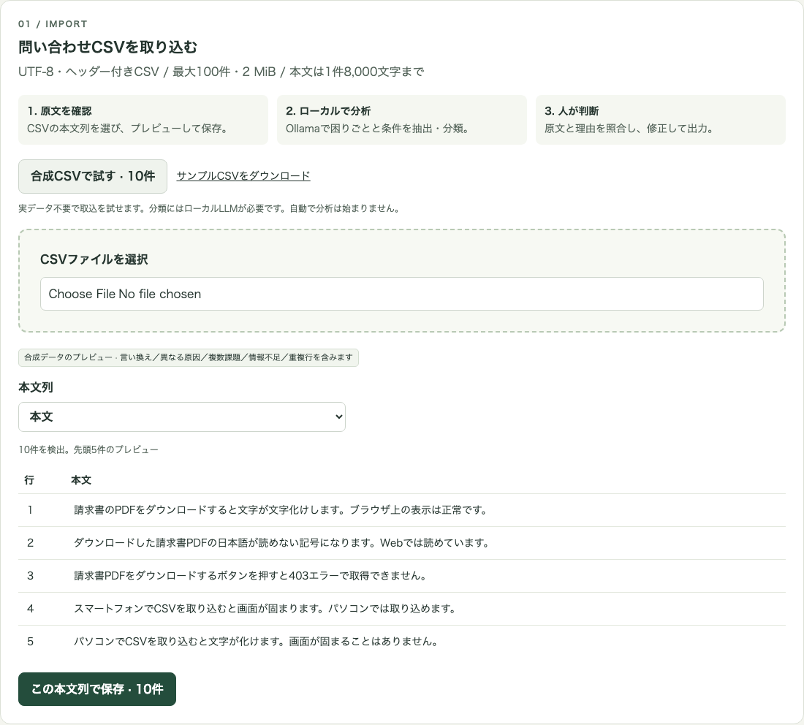
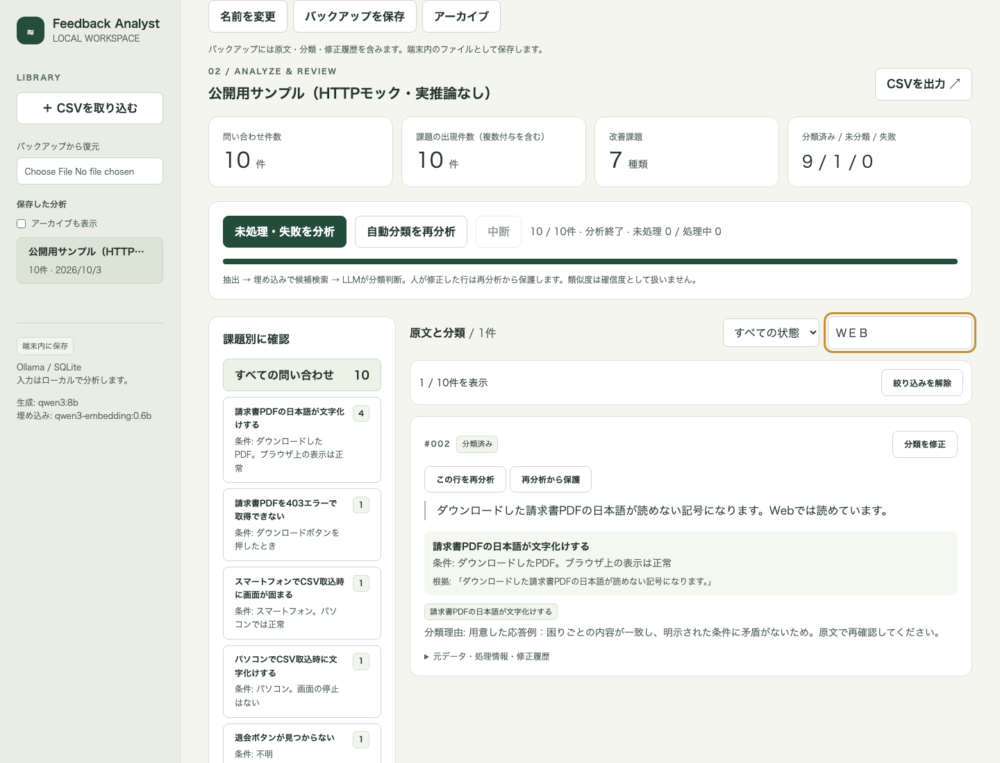
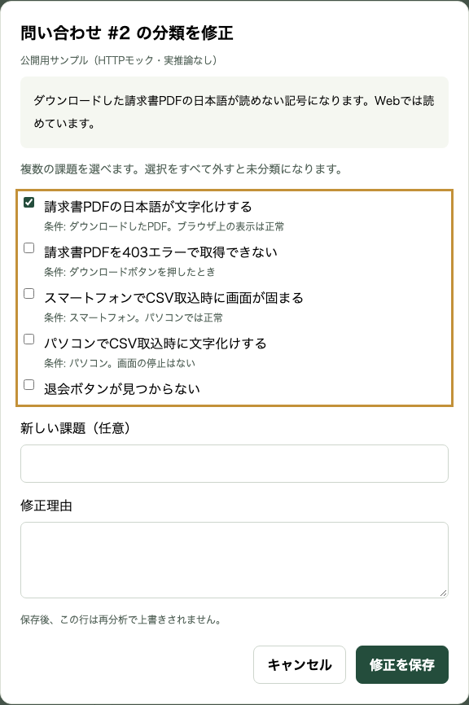
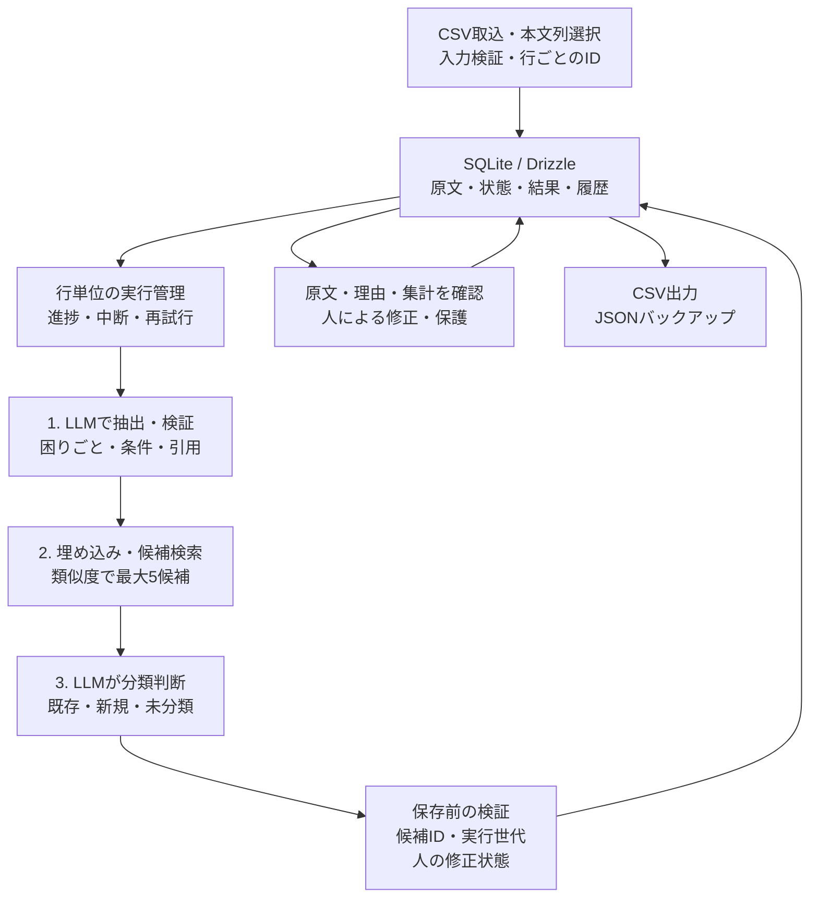
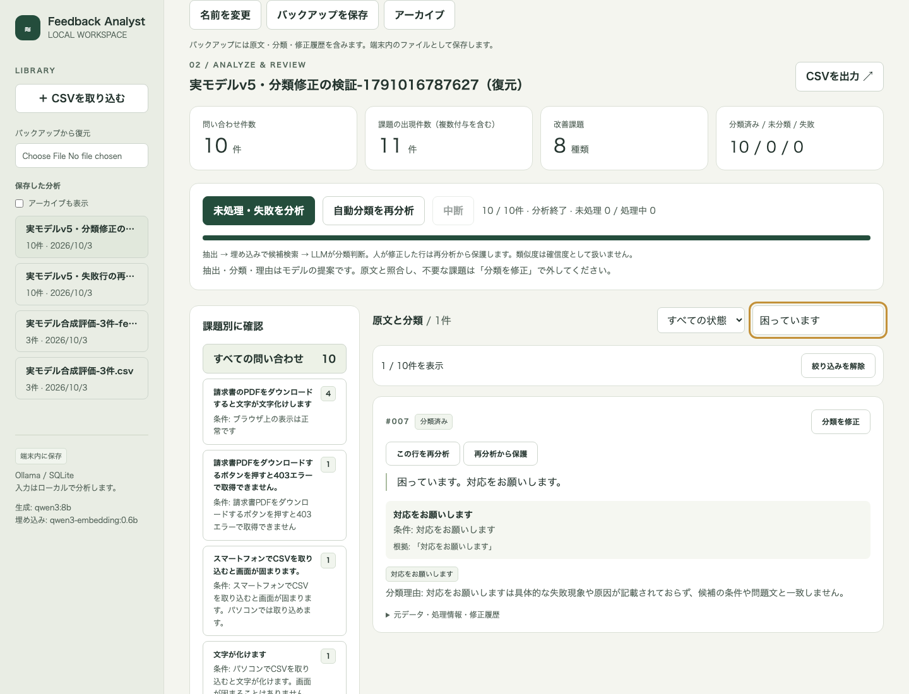
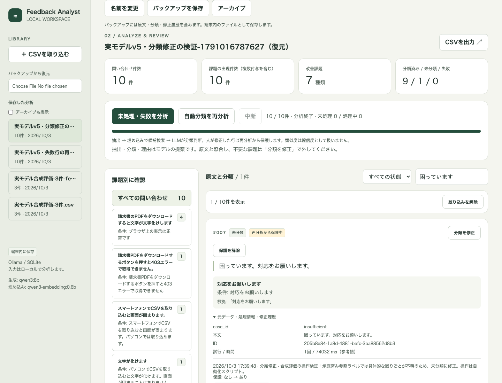

# Local Feedback Analyst

**問い合わせを課題別に整理し、原文を確かめながら人が分類を修正する。**

問い合わせCSVをローカルLLMで分析する、単一ユーザー向けの個人開発プロトタイプです。実装コードは非公開とし、ここでは公開用の合成データと設計・検証の記録を紹介します。CSV取込、困りごとと発生条件の抽出、課題分類、原文との照合、修正履歴、保存・再表示・出力までを実装しました。

**実ローカルモデルによる合成10件の評価と、モデル取得後の外部通信遮断下での推論を実施しました。** 情報不足への過剰分類や不正なJSON応答が残るため、人が確認・修正するプロトタイプです。以下の基本操作3画面はHTTPモックによる撮影です。後半で実モデルの結果と失敗例を分けて紹介します。

| 項目 | 内容 |
| --- | --- |
| 開発形態 | Codexによる実装・テスト・資料作成支援を活用した個人開発 |
| 対象 | 最大100件の問い合わせを端末内で整理する単一ユーザー |
| 画面・サーバー | SvelteKit / Svelte / TypeScript / adapter-node / Tailwind CSS |
| 保存・入力検証 | SQLite / Drizzle / better-sqlite3 / Zod / csv-parse |
| ローカル推論 | Ollama公式JavaScriptクライアント。クラウドへのフォールバックなし |
| 評価したモデル | 生成 qwen3:8b（思考モード）、埋め込み qwen3-embedding:0.6b。人の確認を前提に継続使用 |
| 検証 | Vitest、Playwright、axe-core、GitHub Actions |

## 解決したい課題

問い合わせの表現が違っても、同じ問題を指している場合があります。一方、「PDFを取得できない」と「取得したPDFが文字化けする」は、同じPDFの話でも改善すべき課題が異なります。単に似た文章をまとめるだけでは、調査先や改善方針を誤る可能性があります。

このアプリでは、分類結果を人が確認できることを重視しました。原文、発生条件、判断理由を並べ、複数課題の付与や未分類への変更を可能にしています。件数を把握した後、その根拠となる問い合わせまで戻れる構成です。

## 操作例

2026-10-03、Chromiumの1440 × 1100 pxの画面で撮影しました。取込画面と修正画面は対象領域だけを掲載しています。入力は公開用の架空の問い合わせ10件です。分類・抽出の応答は撮影用に用意したHTTPモックで、**意味の正しさや実モデルの性能を示すデモではありません**。

### 1. 本文列と原文を確認する

初回画面から合成CSVを読み込み、言い換え、別の原因、複数課題、情報不足、重複行を含む入力を試せます。プレビューだけでは保存も分析も行いません。本文列を選んで保存した後、明示的に分析を開始します。

通常の分析ではローカルのOllamaが必要です。サンプルを選んでも、用意した分類結果に自動で置き換わることはありません。

### 2. 件数から原文と理由へたどる

問い合わせ件数と課題の出現件数を別々に数えます。1件に2つの課題があれば、問い合わせは1件、課題出現は2件です。画像の10件中1件は未分類、別の1件は複数課題なので、合計は問い合わせ10件・課題出現10件になります。

課題・処理状態・本文検索を組み合わせて絞り込めます。画像では「Web」を含む1件を表示しています。絞り込んでも、上部の集計はデータ全体を表します。

### 3. 原文を見ながら分類を修正する

修正画面にも原文と課題の条件を表示します。理由を添えて複数の課題を選び直したり、すべて外して未分類へ戻したりできます。

修正後は再分析から保護し、変更前後・理由・時刻を履歴に保存します。履歴から戻す操作も新しい変更として記録します。保護解除は明示操作とし、解除だけでは結果を消しません。

保存済みデータは再表示でき、アーカイブ、JSONバックアップ・別データへの復元、CSV出力にも対応しています。

## 構成と責務

図は通常の分析経路です。基本操作3画面の撮影では、独立したテスト用Ollama HTTPサーバーが用意した応答を返します。後半の修正前後2画面は保存済みの実モデル出力です。アプリ本体にモックへの切替やクラウドへのフォールバックはありません。

## 設計判断

### 検索と分類判断を分ける

抽出、埋め込み、分類判断を別の工程にしました。類似度は候補を探すために使い、分類の正しさや確信度として表示しません。分類判断には抽出した1課題の症状・条件・引用と検索候補を渡します。原文全体を再送すると、同じ問い合わせ内の別課題へ判定対象が移る失敗があったためです。

根拠と条件の引用が原文内に存在すること、分類先IDが候補内にあることをコードで確認します。ただし、引用が存在しても意味的に適切とは限りません。原因を推測しすぎないか、別の課題をまとめないかは実モデルと人手の評価が必要です。

### 再分析の失敗で確認済みの結果を失わない

抽出途中の結果と保存済みの分類を分け、新しい分類が完了するまで前回結果を保持します。失敗時は失敗として表示し、前回結果を集計に含む件数も明示します。未分類、失敗、未処理を同じ状態にしません。

実行ID・中断signal・行のrevisionを確認してから保存し、遅れて返った応答による人の修正の上書きを防ぎます。画面側も応答の順序と選択データを検査し、古い応答で表示が戻るのを防ぎます。

### 小規模な保存と監査可能性を優先する

100件単位のMVPでは、データセット全体をSQLiteのJSONとして保存し、変更をトランザクション内で行います。重複行には別々のIDを与えます。修正履歴を残すため、使われなくなった課題も保持します。

大規模検索向けのベクトルDBや複数ワーカーは導入していません。取込順に分類候補が増える方式には順序依存があり、候補数・入力上限を拡張する際は再評価が必要です。

### 入出力の境界を明示する

本文と保存データを外部サービスへ送信する機能を設けず、Ollama接続をloopback IPに限定します。モデル情報の確認を明示操作で行い、ローカル実体を確認できないモデルを拒否します。共有Ollamaの設定やモデルをアプリから変更しません。

CSV出力では引用符・改行を処理し、数式として解釈される可能性があるセルにアポストロフィを付けます。保存原文は変更しません。JSON復元では版・サイズ・ID・参照関係を検査し、元のデータを上書きせず別データを作成します。保存ファイルは平文で、暗号化や共有利用の認証は対象外です。

## 確認できたことと限界

2026-10-03の紹介対象実装のローカル検証と製品CIを照合した記録です。記事掲載のための追加推論・製品テストは行っていません。次の自動テストではテスト用の固定・合成応答を使い、実モデル評価と分けています。

| 検証 | 条件と結果 |
| --- | --- |
| 型検査・ビルド | Svelteチェックは0 errors / 0 warnings。adapter-nodeビルド成功 |
| Vitest | 46テスト成功。入力境界、件数集計、修正保護、中断、再表示、バックアップ、モデル応答検証など |
| Playwright | 11テスト成功。実ビルド・SQLite・公式OllamaクライアントとHTTPモックで主な操作を確認 |
| アクセシビリティ | 取込・プレビュー・分類・修正の画面でaxeのWCAG 2 A/AA・2.1 AAタグを検査し、検出違反0件 |
| キーボード・狭い画面 | エリア移動、ダイアログのEscapeとフォーカス復帰、390 px幅、長い本文・列名を確認 |
| ローカル通信 | HTTPモックのデモでブラウザ外部リクエスト0件。実Ollamaの通信遮断確認は次節に記載 |

自動アクセシビリティ検査は適合認証ではなく、全状態や支援技術での利用を保証しません。現在のブラウザ検証はChromiumで、Safari・Firefoxと実端末での確認は今後の課題です。

## 実モデル評価で分かったこと

同じ端末で開発中の他アプリの実評価が終了してから、専用Ollamaで逐次実行しました。Apple M6・32 GiB RAM、Ollama 0.34.4、qwen3:8b Q4_K_M、qwen3-embedding:0.6b Q8_0を使用。生成設定はtemperature=0、seed=42、コンテキスト16,384、生成上限3,000、思考モード有効、要求ごとの180秒上限です。

モデル・依存取得後、macOSのプロセス単位の制限でOllama・アプリ・評価ブラウザの外向き通信を拒否しました。外部TCPはEPERM、loopback接続と実推論は成功しています。OS全体の通信設定や共有Ollamaは変更していません。この端末・設定での確認であり、全環境のオフライン保証ではありません。

合成10件の参照ラベルは本人が承認しました。最終版v5の初回の課題対応と「情報不足の1件を未分類へ修正」という判定も承認され、同じ課題名・条件引用に限り後続試行へ対応を適用しています。全理由文の正しさの承認とは区別します。

| v5の試行 | 処理完了 | 要修正行 | 誤統合ペア | まとめ漏れペア | 全体時間 |
| --- | --- | --- | --- | --- | --- |
| 1 | 10 / 10 | 1 / 10 | 0 / 6 | 0 / 6 | 565.3秒 |
| 2 | 10 / 10 | 1 / 10 | 0 / 6 | 0 / 6 | 505.0秒 |
| 3 | 9 / 10 | 1 / 9 | 0 / 3 | 0 / 3 | 661.4秒 |

要修正行は、承認済みの参照ラベル集合と分類結果が一致しない行です。人が実際に操作した回数ではありません。誤統合は同じ課題へ入れた行ペアの誤り、まとめ漏れは同じ参照ラベルなのに同じ課題へ入らなかった行ペアを数えます。最初の2回ではPDF文字化けの4行が6ペアとなり、3回目は失敗した1行を除いた3行・3ペアが比較対象です。

3回目は複数課題の1行でJSON応答の読み取りに失敗しました。残りの行は継続し、失敗は未分類と区別して保存しました。失敗行を品質指標の分母から除外すると比較ペアも減ります。成功した行の誤統合0件だけで、全10件の品質が保証されるとは解釈しません。

3回ともモデルはロード済み。全体時間の中央値は565.3秒、Ollamaと子プロセスのRSS合計ピークは13.81〜14.02 GiBでした。RSSは共有ページの重複やMetal割当の限界がある参考値です。同じ10件を見ながら改善した開発用の反復で、独立した30件や未知入力の精度ではありません。人のレビュー時間・実運用での工数削減は未測定です。[照合用の評価要約](evaluation-summary.json)に条件・ハッシュ・承認範囲を残しています。

### 指標だけでは見えなかった失敗

初期版では正常な表示や依頼文を余分に抽出し、言い換えを別課題にしました。指示を変えると、複数課題の取り違えやCSVとPDFの文字化けの誤統合が現れました。分類対象を1課題に絞り、思考モードを有効にした版ではラベル集合が一致しても、「画面が固まることはありません」を逆の意味に要約しました。

この観測から、条件を原文の連続引用に限定してコードでも照合するv5にしました。それでも情報不足への過剰分類と理由の不整合は残ります。改善した数字だけで完了とせず、原文照合と修正を中心に据えています。

未知入力・入力順変更・100件・別端末での再評価、理由文の妥当性、遅い応答や生成上限への対処が次の課題です。取込上限100件は性能保証ではありません。

### 実際の誤分類を修正する

次の2画面はv5初回の実モデル出力を復元して撮影しました。HTTPモックの分類ではありません。「困っています。対応をお願いします。」に不要な課題が付いた状態で、問い合わせ10件・課題出現11件になっています。

承認済みの修正判定に従い、この行の分類をすべて外して未分類へ変更しました。課題出現は10件へ減り、未分類1件・再分析から保護中になりました。履歴、他9行の不変、CSVの数式対策、再読込後の保持を検証しています。操作はPlaywrightで自動化しており、人が操作した時間や全理由文のレビューを示すものではありません。

実モデルを使った別の3件では中断・再試行・修正保護を確認しました。専用Ollama停止とアプリ再起動後も保存結果・CSVが一致し、モデル不在での接続失敗後は再起動して対象行だけ復旧できます。評価で実際にJSON読取失敗した行も、コピーからの再試行で2課題を返し、他9行は変わりませんでした。これらは操作と保存の検証であり、再試行後の全理由文の正しさを保証しません。

## 担当範囲とAI支援

開発者が目的、MVPの体験、採用技術、評価方針、並行開発時の制約を指定しました。Codexがその指示に基づき、実装案の具体化、コード作成、自動テスト、検証記録、紹介資料の下書きを進めました。本人は合成参照ラベルとv5の課題対応・修正判定を承認しました。全理由文や未知データの品質の承認とは扱いません。

この開発で確認できたのは、LLMの応答が正しいという前提を置かず、失敗の状態と人の修正をデータとして扱うことの重要性です。実測で見つけた誤りを保存し、引用の検査、工程の分離、失敗後の継続と再試行へ反映しました。今後は別の入力で品質と修正の手間を評価します。

[ポートフォリオの一覧へ戻る](../../README.md)
