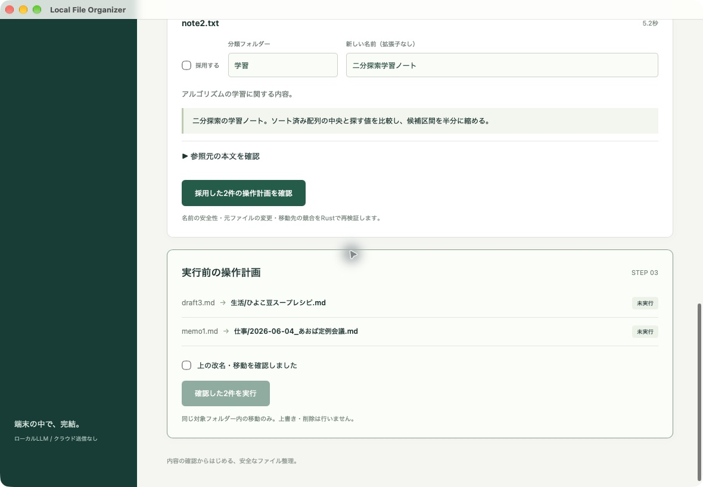
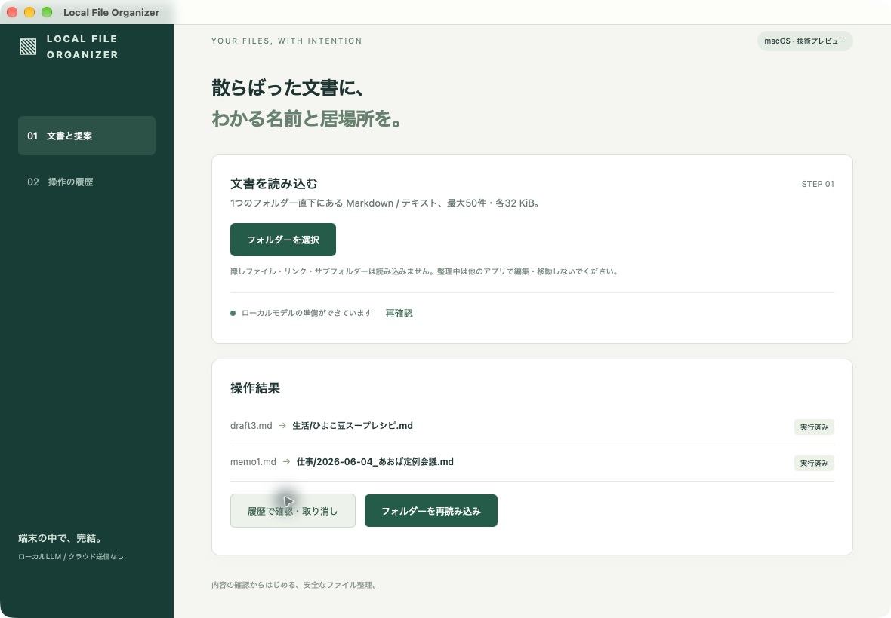

# Local File Organizer

**文書の内容から名前と分類を提案し、確認した変更だけを実行して、履歴から取り消す。**

ローカルLLMでMarkdown・テキスト文書を整理するmacOS向けデスクトップアプリです。モデルには分類・命名の提案を任せ、実際のパス解決とファイル操作はRustが検証します。文書をクラウドへ送るフォールバックは設けていません。

**2026年10月3日：技術プロトタイプとして条件付きで掲載。** 実モデルとmacOS実アプリで主要操作を確認しました。本人・第三者による有用性評価と、GUI全体へ外部通信禁止を適用した受入は未完了です。実用性・時間短縮・完全なオフラインGUI動作を実証したものではありません。実装コードは非公開で管理し、ここでは合成文書の画面と設計・検証結果を紹介します。

## 解決したい課題

「memo1.md」「draft3.md」のような名前では、中身を開くまで何の文書か分かりません。一括改名で手間を減らそうとしても、誤分類や上書き、元へ戻せなくなることへの不安があります。

そこで、提案と実行を分けました。利用者が本文・理由・引用を確認し、候補を個別に採用・編集・見送りにします。実行直前にも元の内容と配置を確認し、履歴を使って変更を取り消せる構成にしています。

## 操作の流れと実画面

1. ネイティブダイアログで1フォルダーを選び、直下のUTF-8 Markdown/TXTを最大50件・各32 KiBまで読み込む。
2. qwen3:8bが分類・名前・理由・本文引用を提案する。モデルへ渡すのは各文書の先頭2,500文字までで、切り詰めを表示する。
3. 候補は初期状態では全件見送り。採用する文書を選び、必要なら分類と名前を編集する。
4. 変更前後の操作計画を確認し、確認欄にチェックして実行する。
5. SQLiteの履歴を再表示し、内容・配置・衝突を再検証して取り消す。

次の画像は、**macOS Tauri実アプリで、実モデルの提案を確認して作った操作計画**です。公開用の合成文書3件から、レシピをそのまま採用、会議名を編集して採用、学習メモを見送りにしました。確認欄が未チェックなので実行ボタンは無効です。

会議名の `2026-06-04_あおば定例会議` は、AIが利用者向けの編集欄から変更した名前です。モデルの元の提案は「架空プロジェクトあおば定例会議」で、保存した生成結果を書き換えてはいません。操作・撮影を担当したのはAIであり、本人の採用結果ではありません。

次は**確認後に実際の改名・移動を完了した画面**です。モックでも、説明用に作った画面でもありません。この後アプリを終了・再起動し、履歴から取り消して、元の3ファイル名と内容の完全一致を確認しました。

保存した提案を開き直す経路も実操作で確認し、「保存済み実生成の再表示」というラベルで新しい推論と区別しています。画像2点はこの再表示経路ではなく、最初の実生成から計画・実行したときの撮影です。

## 構成と技術選定

処理は「文書選択 → ローカル推論 → 提案の検証 → 利用者の採否・編集 → Rustで計画を検証 → ファイル操作と履歴保存 → 状態照合・取り消し」の順です。

| 技術 | 役割と選定理由 |
| --- | --- |
| Tauri 2 / Rust | デスクトップ画面とネイティブ選択を提供し、ファイル操作をRust側へ集約する。汎用シェルや任意パスを操作するIPCは公開しない。 |
| Svelte / Vite / TypeScript / Tailwind CSS | 提案、採否、編集、確認計画、履歴の状態を画面に表す。 |
| Zod / Rustの独立検証 | 編集入力を画面側で案内しつつ、信頼境界となるRust側でもモデル応答と操作計画を検証する。 |
| Ollama / qwen3:8b | 文書の分類・命名を端末内で行う。接続先はloopbackに限定し、HTTP proxyとredirectを無効化する。 |
| SQLite / rusqlite | 操作前の意図と操作後の結果を保存し、途中停止後にファイルの状態と照合する。 |
| pnpm / Vitest / cargo test / GitHub Actions | 通常の合成・モック試験と実モデル評価を分離し、依存をlockfileで固定する。 |

## ファイル操作の設計

モデルから受け取るのはファイルID、分類、名前、理由、引用です。実際のパスや任意のシェルコマンドをモデルに実行させません。引用が入力本文に存在すること、IDが対象文書に対応すること、名前が許可範囲であることを検証します。ただし、形式と引用元が正しくても、意味が正しいとは限りません。

操作は利用者が選んだフォルダー内、同一ファイルシステムの改名と1階層の分類移動に限定しました。隠しファイル、symlink、ハードリンクを除外し、パストラバーサル、既存ファイルへの上書き、名前の衝突を拒否します。計画後の変更は、ファイルの同一性・サイズ・更新時刻・内容ハッシュと、ルート・分類先の同一性を使って検知します。

SQLiteとファイルシステムは一つのトランザクションになりません。そのため、操作前に実行中・取り消し中の状態を保存し、操作後に結果を記録します。再起動後は履歴から原本と移動先を照合でき、推測で再実行しません。取り消しも現在の内容と衝突を確認し、一部だけ戻った状態を表示します。

一方、敵対的な別プロセスが同時に文書やディレクトリを動かす状況の完全な排他は保証していません。操作中は他アプリで対象を編集・移動しない前提です。削除機能はなく、取り消し後の空の分類フォルダーも残します。

## 実モデル評価と改善

確認日：2026年10月3日。対象は0.1.0の紹介対象実装。合成データの作成、評価の実行、意味内容の点検はAIが担当しました。固定6件とプロンプト調整に使わない独立4件を用意しましたが、独立ケースの初回集計と最終比較は観測しており、完全な盲検評価や別の人による評価ではありません。

| 指標 | 初回10件 | 最終10件 |
| --- | ---: | ---: |
| 形式受入（ID・名前・引用） | 8/10 | 10/10 |
| 事前定義した分類との一致 | 4/10 | 10/10 |
| 名前のトピック語との一致 | 7/10 | 10/10 |
| 1件の生成時間・中央値 | 5.46秒 | 5.11秒 |
| 1件の生成時間・p95（nearest rank） | 7.01秒 | 6.56秒 |
| 有効候補の移動・再読み込み・取り消し | 8件 | 10件 |

分類一致・トピック語一致は、人の採用率でも総合的な意味品質でもありません。操作試験で有効候補を全選択したのも自動評価ハーネスです。保存出力を本文と照合した別のAI点検では、そのまま採用する案6件、名前編集案2件、見送り2件となりました。編集距離は名前部分だけで合計32文字。出力観測後の判断であり、本人・第三者の採用実績や操作時間の測定とは区別しています。

初回はレシピを「創作」に分類し、曖昧な文書へ「.」という不正な名前を返しました。分類の定義とJSON enumを明確にし、曖昧な場合も本文の語から命名するよう調整しました。不正な名前はRustで拒否しています。

根拠引用を強めた別の指示では、固定ケースの分類一致が6/6から5/6へ悪化したため不採用にしました。thinkingを有効にした比較でも、固定6件中1件がHTTP 500となり、中央値30.44秒・最大49.36秒へ待ち時間が増加したため不採用です。HTTP 500の内部原因は未特定で、失敗を成功へ置き換えていません。

最終設定にも問題は残ります。攻撃文を記録した会議メモでは、分類と名前は妥当でも、理由に「指示文は文書整理の命令として扱う」という誤った説明があり、引用も攻撃文を選んでいました。英語の園芸メモでは「料理や家事に関連する」という粗い理由と英語の名前が返っています。これらから、分類・命名の一致だけでなく、理由と引用の関連性を別に点検する必要があると分かりました。

## 実測と検証範囲

環境はmacOS 27.0.1 / Apple Silicon / メモリ32 GiB、Ollama 0.34.4。モデルはqwen3:8b（8.2B / Q4_K_M）、temperature 0、seed 42、think false、num_ctx 8,192、num_predict 512。共有評価枠を確保し、別のモデル評価との競合を確認して測定しました。

| 検証 | 確認できたことと限界 |
| --- | --- |
| 待ち時間・メモリ | 最終10件の中央値5.107秒。専用Ollama serverとrunnerのRSSを0.5秒間隔で測定し、合計ピーク約6.24 GiB。GUI・GPU統合メモリ全体・OS全体のピークではない。 |
| ローカル自動検証 | 紹介対象実装でRust 22件、Vitest 3件、型検査、フォーマット、Clippy、Tauri debugアプリのビルド成功。モック成功を実モデル品質と混同しない。 |
| macOS実アプリ | 合成3件で実生成・採否・編集・計画確認・2件実行・再起動・保存提案再表示・取り消しを確認。元の全3件の名前と内容ハッシュが一致。生成時間は7.658 / 4.492 / 5.225秒で、上表の10件とは別の操作受入。 |
| 古い計画・取り消し競合 | GUIで外部変更後の計画拒否を確認。取り消し先に別文書がある場合は両方を保持し、競合しない操作だけ取り消した。競合解消後の残りの取り消しも確認。 |
| 中断・保存障害 | GUIで中断時に完成済み1件を保存し、起動時のDB準備失敗を表示。操作途中のDB書き込み失敗と復旧はRust自動試験。実電源断や実ディスク満杯の試験ではない。 |
| オフライン | Rust評価プロセスと専用Ollamaの外部通信を禁止し、実推論・保存・移動・取り消しが成功。GUI試験中の専用Ollamaも制限したが、アプリ全体へ制限した起動では操作ツールが取得できず、**GUI全体のオフライン受入は未完了**。 |

最終の製品GitHub CIはアカウントの実行制限でジョブが開始されず、関連する製品PRも未マージです。本人の指示でCI復旧・マージを今回の掲載判定から除外しました。ローカル成功をCI成功として記載していません。

## 制約と次に評価したいこと

- 対象はmacOS、1フォルダー直下のMarkdown/TXT。PDF・画像、再帰的な大量処理、常時監視、Windows/Linux、署名・公証付き配布は対象外。
- 推論入力は各文書の先頭2,500文字。後半だけに主題がある文書の品質は保証しない。生成は1件120秒・全体15分で制限する。
- 中断で古い応答を破棄し、保存済みの部分を残す。Ollama側の計算が即時停止する保証はない。
- 10件の合成品質評価と3件の既知ケースによるGUI受入であり、実文書一般の精度や最大50件処理の待ち時間を保証しない。
- 本人・第三者による採用率、修正量、手作業との時間比較は未測定。実用性を主張するには新しい独立ケースと人の評価が必要。
- GUI全体の外部通信禁止下での受入、実電源断、ストレージ故障は未確認。未検証を完了扱いにせず、技術プロトタイプとして掲載する。

## 本人とAI支援の担当

本人が目的、主要体験、採用技術、安全性・評価方針、並行開発時の制約を指定し、CIを掲載判定から除外する判断と今回の掲載指示を行いました。Mac mini上でアプリの表示も確認していますが、主要手順の本人評価や有用性評価はまだありません。

AI（Codex）が詳細設計、実装、合成データ、テスト、実モデル評価・意味点検、macOS実アプリ操作・撮影、記事作成と差分点検を支援しました。AIの点検を第三者の承認や本人の実用評価とは扱っていません。本人が実装を直接書いたという主張もしていません。

[ポートフォリオの一覧へ戻る](../../README.md)
