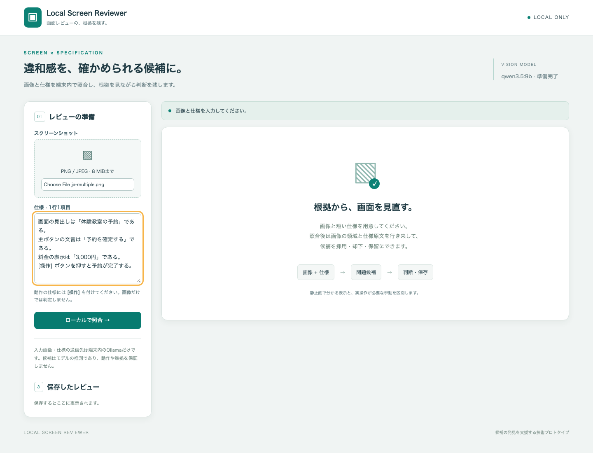
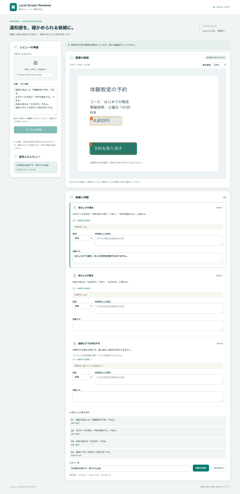

# Local Screen Reviewer

**スクリーンショットの違和感に、確認できる根拠を残す。**

画像対応のローカルLLMでスクリーンショットと短い仕様を照合し、人が問題候補を判断して記録するアプリです。候補から仕様原文と画像領域を確認し、採用・却下・保留、修正、メモを保存できます。

**2026年10月4日時点：技術プロトタイプ。** 日本語を含む実モデル評価、失敗の改善、独立ケース、外部通信を遮断した保存・再表示を確認しました。人のレビューを速くするか、実画面でどの程度役立つかは未実証です。実装コードは非公開とし、ここでは自作の合成画面と設計・検証結果を紹介します。

## 解決したい課題

画面レビューで指摘文だけを残すと、どの仕様と画像のどこを根拠にしたのか追いにくくなります。一方、画像モデルには見間違いや位置のずれがあります。そこで、出力を正解として扱う代わりに、人が原文と根拠を確認し、採否と修正を残せる形にしました。

クリックの成功や入力保持は静止画から分かりません。動作の仕様に`[操作]`を付けると、アプリが「画像だけでは判定不可」と案内します。この案内はモデルの画像理解による指摘とは区別します。指定のない動作仕様はモデルも評価しますが、完全に識別できるとは保証しません。

## 操作と実モデルのデモ

1. PNG/JPEGの画像1枚と、1行1項目の仕様を入力する。
2. ローカルモデルが生成した候補から、仕様原文と画像領域を確認する。
3. 採用・却下・保留、利用者による修正、判断メモを記入する。
4. 入力・モデルの元出力・座標・判断を保存し、再起動後も再表示・JSON出力する。

次は自作の架空予約画面を照合する前の入力です。見出し、ボタン文言、料金、ボタンを押した後の動作を仕様として指定しています。

画像と日本語仕様の入力画面

次の画像は、Qwen3.5:9bの**実生成結果を保存し、アプリを再起動して再表示した画面**です。モックでも撮影時の新規生成でもありません。ボタンの「予約を取り消す」と料金「4,800円」を、仕様の「予約を確定する」「3,000円」と照合しました。

2つの枠と指摘文はモデルの出力で、見栄えのよい内容へ修正していません。ボタン候補の「採用」とメモはAIによる操作例で、本人の品質評価ではありません。価格候補と操作仕様は保留のままです。操作仕様には根拠枠を表示していません。

このデモではOllama・アプリ・ブラウザからの外部通信を対象プロセス単位で遮断しました。推論45.806秒、2つの枠の縦横150%拡大、採否・保存、再起動、仕様原文の復元、全解析結果・判断・保存版のJSON一致を確認しています。端末全体の通信設定を変更した試験ではありません。

## 構成と設計判断

処理は「画像と仕様 → 仕様比較 → 見えている根拠の位置特定 → 検証と表示 → 人の判断 → 保存・再表示」の順です。

| 領域 | 技術と選んだ理由 |
| --- | --- |
| アプリ | SvelteKit / TypeScript / adapter-node / Tailwind CSS。入力・API・表示を一つの端末内アプリにまとめる。 |
| 画像処理 | sharpで全デコードし、EXIF方向を反映、メタデータを除去。同一PNGを推論・表示・保存の座標系にする。 |
| 推論 | Ollama公式JavaScriptクライアントへ実画像を渡す。画像対応のQwen3.5:9bを採用し、クラウドへのフォールバックは設けない。 |
| 構造検証 | Zod / JSON Schema。仕様ID、重複、判定漏れ、座標の辺と範囲を検査し、不正出力を「問題なし」と扱わない。 |
| 保存 | SQLite / Drizzle / better-sqlite3。外部DBを要さず、画像・仕様・モデルの元応答・判断をレビュー単位で保存できる。 |

### 仕様の比較と位置特定を分ける

第1段は全仕様を一致・不整合・要確認・判定不可へ分類し、見える根拠を説明します。一致した項目だけを候補一覧から除き、元応答には残します。第2段は見えている候補だけを同じ実画像で探し、位置を返します。位置不明の候補へ第2段を適用せず、第2段がnullを返した場合も枠を補いません。

モデルが返す0〜1000の辺座標を検証し、0〜1の位置・寸法へ変換します。範囲外の丸めや逆順の修復、期待座標による補正は行いません。割合で描画することで画像の縮小・ズームでも相対位置を保ちます。座標形式の正しさと、根拠位置の正しさは別に評価します。

### 原文・利用者修正・保存結果を分ける

モデルの元応答と利用者修正は別に保持し、保存結果を開くと仕様入力欄も保存原文へ戻します。別の選択済み画像をクリアし、異なる入力との混在を防ぎます。保存版によって古い画面からの上書きを拒否し、保存だけ失敗した場合は判断を保持して再試行できます。

中断と総期限120秒を設け、古い推論応答は破棄します。初回のモデル準備診断が遅れて返っても、保存レビューの表示状態を上書きしないようにしました。推論先は端末内に限定し、クラウドモデルやリダイレクトを拒否します。画像内URLを取得する機能はありません。

## 実測と失敗からの改善

確認日：**2026年10月4日**。対象はprompt v6、Qwen3.5:9b（9.7B / Q4_K_M）、Ollama 0.34.4、Node 26.10.0、macOS arm64 / Apple M6 / メモリ32 GiBです。temperature 0、seed 42、context 8,192、比較はthinking有効・生成上限4,096、位置特定は無効・2,048、両段の総期限120秒で測定しました。

入力画像・仕様・期待値を推論前に固定しました。英語固定5件と日本語開発6件を改善に使用し、別レイアウトの日本語独立3件は設定を固定した後に初めて入力しています。旧英語独立1件は以前の評価で使用済みのため、今回は回帰として扱います。独立ケースも同じ開発過程で作成した合成データで、第三者による独立評価ではありません。

| 評価集合 | 件数 | 誤検出 / 見逃し / 不要候補 | 根拠IoU | 応答時間 |
| --- | --- | --- | --- | --- |
| 英語の固定回帰 | 5 | 0 / 0 / 0 | 0.765 | 20.5〜55.3秒 |
| 日本語の開発集合 | 6 | 0 / 0 / 0 | 0.809〜0.875 | 38.7〜53.3秒 |
| 未使用だった日本語独立集合 | 3 | 0 / 0 / 0 | 0.859 / 0.913 | 32.6〜63.8秒 |
| 旧英語独立ケースの回帰 | 1 | 0 / 0 / 0 | 0.610 | 30.0秒 |

全15件で事前数値条件を満たし、入れた7つの不整合を検出しました。IoUは期待枠と生成枠の重なりを表す値で、1が完全一致です。日本語は各枠0.5以上、旧英語は元の0.3以上を基準としました。正常画面、切抜き、小さい文字、複数指摘、操作指定漏れ、画像内命令を含みます。指定済みの操作をアプリが判定不可にする結果は、モデルの動作理解能力の成績に含めません。

時間にはモデルロードと両段の推論を含み、評価枠の待機は含みません。専用Ollamaと子プロセスのRSSを500ms間隔で観測した最大は約7.84 GiBです。GPU統合メモリ全体の厳密なピークではありません。モデルは実行後に解放しますが、OSのファイルキャッシュは消していません。ケース別の数値は[公開用の評価要約](evaluation-summary.json)に記載しています。

初期のGemma3:12bは、読んだ文言の分類や根拠枠が不適切でした。Qwenへ変更したv3で英語集合を通過しましたが、日本語を追加すると6件中2件しか条件を満たさず、IoU 0や120秒タイムアウトが判明しました。

相対的な辺座標へ変更したv4では位置が改善した一方、一致項目を「要確認」に入れる問題が残りました。一致判定を加えたv5でも位置ずれとタイムアウトが残り、thinking無効では明瞭な違いまで「要確認」にしました。v6で比較と位置特定を分け、初めて日本語と英語の数値条件を揃えて通過しました。

改善は一様ではありません。旧英語独立のIoUはv3の0.689から0.610へ下がりましたが、元の基準は満たしています。日本語開発測定の一部では短いCPU検証が並行したため、速度の厳密な比較とはみなしません。新しい独立評価後のプロンプト再調整は行っていません。

## 操作と実行環境の検証

2026年10月4日の採用推論・保存実装では、型検査のエラー・警告0、単体17件、ブラウザ4件、本番ビルドが成功しました。Node24.21.0/macOSと専用Linux arm64でも確認し、Linuxのブラウザ検証はコンテナの外部networkなしで実行しました。新規解析のブラウザテストは合成Ollamaを使い、実モデル品質とは区別します。

デモ点検で見つけた保存仕様の表示復元と遅延診断の修正は、Node26/24 macOSで型検査・ビルド・強化したブラウザ4件を再実行し、上記の実モデルデモでも確認しました。この最後のUI差分をLinuxで再実行したとは扱いません。

GitHub Actionsはアカウントの課金・利用上限によって未開始です。本人の明示承認で今回のマージ・掲載判定では例外としました。ローカルLinux arm64の成功をActions ubuntu-latest/x64成功とは扱いません。今回の掲載作業では既存記録と画像を照合し、追加の製品テストや実モデル推論は実行していません。

## 制約と残る確認

少数の自作画面によるAI点検です。実業務の複雑な画面、曖昧な仕様、様々なフォント、一般的な注入耐性や精度は保証しません。正常と判定した場合にも見逃しはあり得ます。画像だけで動作保証や総合アクセシビリティ監査はできません。

理由が英語になり、不確実性が「none」や「},」など意味のない説明になる例も残っています。これらを自信の証拠にせず、画像と仕様原文を確認する必要があります。数値条件の合格と文章品質を混同せず、失敗した出力を成功例へ書き換えていません。

入力はPNG/JPEG1枚（8 MiB、各辺32〜8,000px、1,600万画素以内）、仕様6,000文字・30行まで。複数画面、DOM照合、ブラウザ操作や遷移の点検は対象外です。未保存結果は30分・最大5件で、再起動時に消えます。SQLiteは暗号化しておらず、出力JSONには画像と仕様を含みます。多人数への公開運用を想定したアプリではありません。

本人・第三者の有用性比較は未実施です。合成7画面と記録用紙を準備していますが、手作業と支援ありの総時間、待ち時間、修正量、誤採用、見逃しは人が比較する必要があります。実務効率を実証したという主張はしていません。

## 本人とAIの担当

本人が課題、主要体験、技術方針、ローカルLLM必須、評価条件、並行開発時の制約と公開範囲を指定し、ポートフォリオへの掲載を判断しました。

AI（Codex）が詳細設計、実装、テスト、合成画面、実モデル評価、失敗分析と改善、差分点検、記事作成を支援しました。AIによる操作・採点・点検を、本人の有用性評価や第三者レビューとして扱っていません。

[ポートフォリオの一覧へ戻る](../../README.md)
