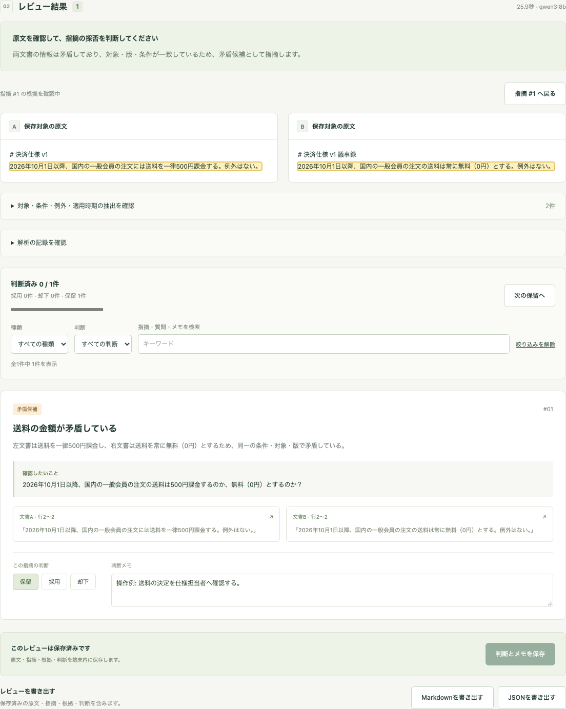
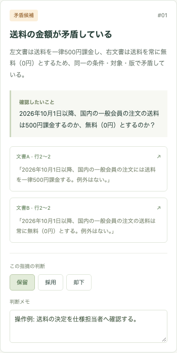
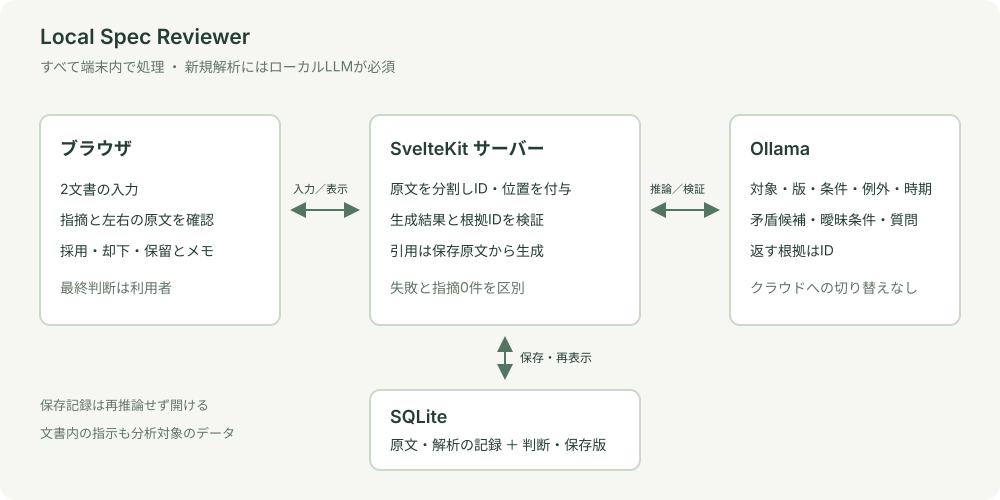

# Local Spec Reviewer

**原文を確認して、人が判断するローカル文書レビュー。**

仕様書と議事録のような2つの短い文書を比較し、ローカルLLMが食い違い・曖昧な条件・確認質問を提示するMVPです。指摘から両方の原文へ移動し、採用・却下・保留とメモを保存できます。

**2026年10月3日時点：評価継続中の技術検証プロトタイプ。** 入力から実ローカル推論、根拠確認、保存・再表示までの接続は確認済みです。実務文書での検出精度、指摘の有用性、レビュー時間の削減は未検証です。ソースコードと実行環境は非公開とし、このページでは合成文書の画面・設計判断・検証結果を紹介します。

## 解決したい課題

仕様書と議事録で同じ対象の条件が違っていても、金額や日付だけを比べると、適用時期や例外の違いを見落とします。LLMに結論だけを出させると、引用が原文に存在するか、指摘を採用してよいかの確認も難しくなります。

そこで、対象・版・条件・例外・適用時期を抽出して比較し、指摘を「候補」として提示します。利用者が根拠と原文を往復し、最終判断を記録する体験を中心にしました。文書をクラウドへ送らず、端末内のOllamaで推論します。

## 操作の流れ

1. 短いMarkdown／テキスト2文書を貼り付けるか、UTF-8ファイルから読み込む。
2. ローカルLLMで抽出・比較し、矛盾候補や確認質問を見る。
3. 根拠カードから左右の原文を確認する。
4. 採用・却下・保留とメモを保存する。
5. 履歴から再推論なしで開き直す。JSON／Markdownの書き出し、JSONからの復元も可能。

次の画面は**架空の送料仕様に対する2026年10月3日の実モデル出力を、保存記録から開き直して撮影**したものです。画面収録時に新たな推論は行っていません。モデルの抽出・指摘は変更せず、保留と判断メモは操作例として入力しました。実際の利用者による採否評価ではありません。

「500円」と「無料」の食い違いを候補として出せています。一方で、この出力には**抽出した版v1を裏付ける見出しIDの欠落**があります。原文内の引用位置が正しいことと、指摘・抽出を意味的に十分裏付けることは分けて評価しています。

狭い画面での指摘・根拠・判断

## 構成と設計判断

| 選択                                                 | 理由と制約                                                                                   |
| ---------------------------------------------------- | -------------------------------------------------------------------------------------------- |
| SvelteKit / TypeScript / adapter-node / Tailwind CSS | 入力・API・表示を一つのローカルアプリとして構成。ネイティブのSQLiteを扱えるNode実行を採用。  |
| Ollama公式JavaScriptクライアント                     | 端末内で生成モデルを実行。クラウドへの切り替えを設けず、接続不可は失敗として表示。           |
| unified / remark-parse                               | アプリ側で文書を分割し、安定したIDと原文位置を作る。モデルに引用本文の生成を任せない。       |
| Zod                                                  | 生成結果・根拠ID・取り込みデータを検証。不正な出力を「指摘なし」と扱わない。                 |
| SQLite / Drizzle / better-sqlite3                    | 原文・モデル出力の不変スナップショットと、変更可能な判断を分離。保存版による競合検出を行う。 |

根拠IDは文書内容・左右の区別・原文位置から作り、返されたIDの存在と矛盾候補の双方根拠を検査します。根拠カードの引用本文は保存原文から生成するため、そのカードの引用がモデルによって書き換わることを防ぎます。モデルの説明文には原文と異なる自己引用が出た例があり、説明文の正確性は別に確認する必要があります。引用の意味が結論を支えるかまでは構造検証だけでは保証できません。

入力を変えた後の古い応答は破棄します。中断・時間切れ・入力不足・不正出力・保存失敗を区別し、保存だけ失敗した場合は再推論せず再試行できます。文書内の命令は分析対象のデータとして扱い、モデルにツール実行を与えていません。これも、あらゆる文書内命令に耐えるという保証ではありません。

初回起動ではOllamaの準備状態を確認できます。この確認は文書送信や推論を行いません。保存済みレビューの閲覧・復元はOllamaが停止していても使えます。

## 検証と分かったこと

検証日：2026年10月3日。自動操作と実モデル評価には合成データだけを使っています。紹介対象のローカル検証・製品CI・保存済み評価記録を照合した結果で、記事掲載のための追加推論や製品テストは実行していません。

| 種類                       | 結果と意味                                                                                                                                                                 |
| -------------------------- | -------------------------------------------------------------------------------------------------------------------------------------------------------------------------- |
| 自動回帰テスト             | Vitest 54件、Playwright 26件が成功。型検査はエラー・警告0、adapter-nodeビルド成功。ブラウザの新規解析テストは合成応答であり、モデル精度の評価ではない。                    |
| 保存記録の操作確認         | 過去の実モデル出力1件を実アプリ/API/SQLiteへ取り込み、左右原文への移動、判断保存、再表示、狭い画面を確認。新しい推論0回、元スナップショットと一致。                        |
| 初回の実モデル評価         | 矛盾あり／矛盾なし／適用時期だけが異なる3ケースで、矛盾有無は期待と一致。各1回、約14.4〜27.0秒。少数例の接続確認であり、一般的な精度・速度を示すものではない。             |
| 根拠条件を厳しくした再採点 | 上記3ケースとも、見出しを根拠に含めない点で失敗。正常終了と評価成功を分けて記録。                                                                                          |
| 改善候補の実モデル評価     | 見出し引用を促す候補は12件中4件成功、8件失敗。別候補は単純な矛盾を見逃したため途中中断し、完了6件中2件成功・4件失敗。いずれも通常解析へ不採用。                            |
| 外部通信を遮断した確認     | モデル取得後、アプリ・Ollama・ブラウザの対象プロセスをloopback以外の通信が拒否される条件で起動し、実推論から保存・再表示まで確認。端末全体のネットワーク切断試験ではない。 |

実モデル評価はqwen3:8b（8.2B / Q4_K_M）、Ollama 0.34.4、Node 24.21.0、Apple M6・32 GiB・arm64のmacOS環境で実施しました。生成設定はtemperature 0、seed 42、context 16,384、出力上限4,096、think falseです。初回のモデル読み込みと後続のウォーム実行が混在するため、時間を厳密な性能比較には使いません。

その後、通常版と二段階候補を既存12件と別ドメイン8件で各1回、計40解析試行しました。

| 方式 | 試行 | 総合採点の通過 | 採点失敗 | 実行エラー | 矛盾の誤検出 |
| --- | --- | --- | --- | --- | --- |
| 通常版 | 20 | 0 | 20 | 0 | 0 |
| 抽出と比較を分けた二段階候補 | 20 | 10 | 9 | 1 | 8 |

総合採点には状態・件数・根拠条件などを含みます。誤検出はケース単位の矛盾有無を期待値と照合した数で、実行エラーはこの判定に含めません。通常版にも見逃しがあるため、誤検出0件だけで品質が十分とは判断できません。候補は対象・版・時期の差などを矛盾にする退行があり、**通常解析へ不採用**としました。一般的な精度を表す数字ではありません。

見出し引用の指示を強めるだけでは改善せず、抽出と比較を分離しても十分ではありませんでした。二段階候補は見出し根拠や一部の見逃しを改善した一方、9月までの規定と10月以降の規定、管理者と閲覧者の権限差を矛盾にする退行がありました。悪化した候補を採用せず、通常経路を維持しています。

通常版の0/20件通過は、すべての結論が誤りという意味ではありません。基本3ケースの矛盾有無は正しくても、見出し根拠の不足で総合採点が失敗します。一方で通常版にも実際の見逃しが残っています。採点は意味や全抽出項目の正確性を保証せず、候補の通過例でも適用日を条件欄へ入れて時期欄を「不明」とした例がありました。

評価条件にも限界があります。「48時間以内」と「24時間以内」を矛盾とするケースは両立する読み方もあるため、固定集計を維持しつつ期待値の問題として記録しました。次の評価では、両立する上限と衝突する値を区別します。今回使用した別ドメイン8件は、今後の候補調整に対する未使用データとは扱いません。

## 現在の限界と次の検証

- 根拠の意味、見逃し、指摘の有用性について、人手による評価は未実施。
- 少数の合成ケース・単一モデル・単一設定の結果であり、実文書の精度や業務改善効果を主張できない。
- 短い2文書向け。長文、PDF、複雑な文書間参照、複数文書の横断比較は対象外。
- SQLiteは端末内の平文保存。認証・暗号化・多人数への公開運用はMVPの範囲外。
- 反復した性能測定、ピークメモリ測定、幅広いブラウザ・OSの検証は未実施。

次に、対象・版・期間の比較可能性、入力不足の判定、抽出項目の意味を評価する新しいケースを用意し、人が根拠と指摘を採点します。検出件数を増やすだけでは採用せず、誤検出・見逃し・判断にかかる時間を検証します。

## 本人とAIの役割

本人が、解決したい課題、原文から人が採否を決める体験、ローカルLLM必須、採用技術、MVPの範囲、評価方針、並行作業との実行制約を指定しました。

Codexが、詳細設計、実装、テスト、ブラウザ操作、合成ケースによる実モデル評価、失敗の記録、資料作成を支援しました。画面の操作例と自動テストの成功を、本人による精度評価や実務での成果として扱っていません。

[ポートフォリオの一覧へ戻る](../../README.md)
