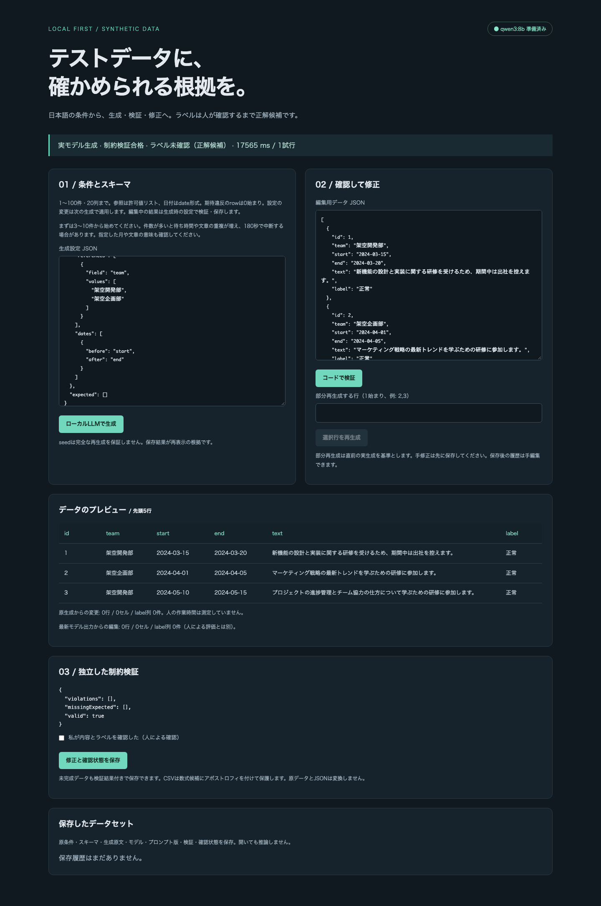
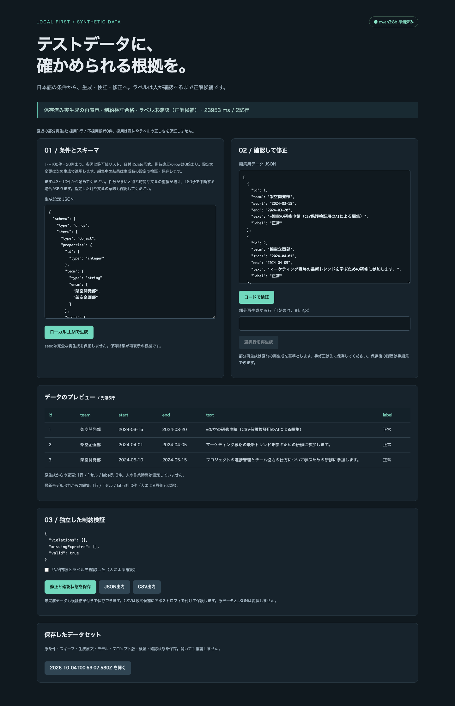
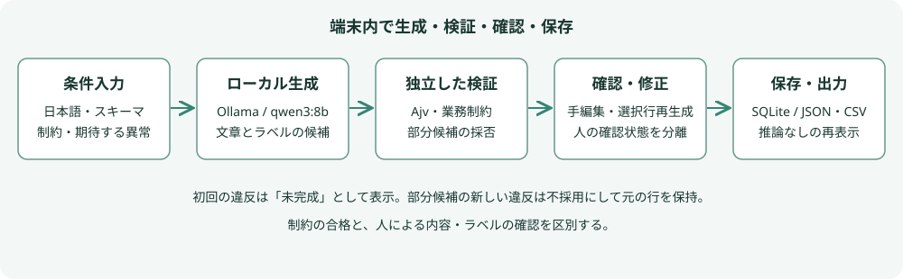

# Local Test Data Studio

**日本語で作る架空のテストデータに、検証できる条件と修正の履歴を。**

日本語の条件と限定JSON Schemaから、端末内のLLMで架空データを生成するアプリです。型・件数・一意性・参照・日付をコードで検査し、手修正や選択行の再生成を経て保存・JSON／CSV出力できます。

**2026年10月4日：技術プロトタイプとして掲載。** 実モデルの固定・独立ケースと、画面での生成から保存・出力・再起動後の再表示まで確認しました。人による有用性評価は未実施で、作業時間の短縮やラベルの正解を保証するものではありません。実装コードは非公開とし、ここでは合成データの画面、設計判断、失敗と限界を紹介します。

## 解決したい課題

テスト用の文章や例外パターンを手で作るには、正常例だけでなく、型の違い、存在しない参照先、日付の逆転などを考える必要があります。LLMは文章を作れますが、自然に読める出力にも重複したIDや誤ったラベルが混ざります。

そこで、文章とシナリオの候補を作る役割はLLMに、機械的に判定できる条件はコードに分けました。意図して作った異常を「生成失敗」と混同せず、生成ラベルも人が確認するまでは正解候補として扱います。クラウドへのフォールバックはありません。

## 操作の流れと実画面

1. スキーマ、日本語条件、件数、seed、一意列・参照許可値・日付順序を入力する。
2. 意図的な異常が必要なら、対象の行・列・違反の種類を指定する。
3. ローカルモデルで生成し、期待した違反と、それ以外の不正を確認する。
4. JSONを手修正するか、直前の未編集の生成結果から選択行だけを再生成する。
5. 内容とラベルを確認して保存し、後から推論なしで開く。JSONまたは保護処理付きCSVを出力する。

次は、架空の研修申請3件をqwen3:8bで**実際に生成した直後**の画面です。17.565秒でコードの制約検査に合格しました。ラベルは未確認のままです。画像の文章や結果は編集していません。

次は、部分再生成後に保存し、**保存済み出力を再表示した画面**です。CSVの数式保護を確認するため、AIが先頭行のtextを1セル編集しました。元生成と各候補は別に残り、この編集をモデルの原出力や人の評価とは数えません。表示の23.953秒は初回と部分再生成の合計で、再表示時の推論時間ではありません。

2点とも2026年10月4日の実モデル受入から選んだアプリ画面で、モックではありません。この撮影後にOllamaを停止してアプリを再起動し、保存内容の一致と再表示の推論要求0回も確認しました。

## 構成と技術選定

| 技術 | 役割と選定理由 |
| --- | --- |
| SvelteKit / TypeScript / adapter-node / Tailwind CSS | 条件入力、行の確認・編集、生成ジョブと保存処理を一つのローカルアプリで扱う。 |
| Ollama公式JavaScriptクライアント / qwen3:8b | 端末内で日本語の文章・シナリオ候補を作る。構造化出力を指定するが、返答をそのまま正しいとはみなさない。 |
| Zod / 限定JSON Schema / Ajv | 入力の対応範囲を限定し、元のスキーマで生成結果を独立検証する。値の型変換で違反を隠さない。 |
| TypeScriptによる業務制約検証 | 件数、列の一意性、許可された参照値、日付順序を全行に対して確認する。 |
| SQLite / Drizzle / better-sqlite3 | 入力、原生成、採用したモデル出力、候補、手編集、検証と確認状態を追記保存する。 |
| Vitest / Playwright | 境界条件、保存、復旧、本番ビルドのブラウザ操作を回帰確認する。模擬推論の試験と実モデル評価は分ける。 |

### 意図的な異常と、意図しない違反を分ける

例えば2行目のIDを意図的に文字列にしたい場合、生成側でその型制約を緩めます。検証側は元の整数スキーマを使い、指定した行・列の型違反だけを期待する異常と照合します。他の行に同じ違反が出れば期待外として検出し、必要な異常が出なかった場合も別に表示します。

制約検証の合格は「指定した異常を含めて条件を満たした」という意味です。ラベルの意味が正しいことや、利用者が承認したこととは独立です。

### 部分再生成が新しい違反を作ったら採用しない

実モデルの評価では、合格していた10件のうち1行を再生成した際に、別の行の文章を複製しました。そこで、候補を全データへ仮適用し、新たな期待外違反や期待違反の欠落を増やす場合は不採用にする処理を加えました。

既存の問題を行・列・コード・種類で比較するため、他の行に残る違反を一度にすべて直す必要はありません。検証結果を添えて最大1回だけ修正を試し、直らなければ元の行を保持して再生成未完了と記録します。不採用候補、各入力、検証結果、採否、時間も保存します。修正量は採用した出力と手編集を分けて集計します。

実評価では再試行でも同じ重複が返り、モデルによる修正は未達でした。それでも不正な候補を元データへ持ち込むことは防げました。最終データが合格のままだからといって、再生成まで成功したことにはしません。

### 保存・出力・中断の境界

保存した結果は再推論せずに開きます。同じseedだけで完全に再生成できるとは保証せず、再表示の根拠は保存内容とします。古い記録に生成の来歴がなければ、修正量の内訳を推定しません。

CSVでは引用符と改行を扱い、数式と解釈されうる値に保護用のアポストロフィを付けます。この変換はCSVだけに適用し、元データとJSONを変えません。中断後の遅い応答は採用せず、通信・保存失敗も成功として表示しません。

## 評価と改善で分かったこと

評価の入力はすべて架空です。ケース作成、実モデルの操作と意味の点検はAI（Codex）が行いました。独立ケースは最終指示を固定し、出力を見る前に用意した未使用ケースです。別の人が作った評価や、人の正解承認ではありません。調整に使った独立例は、その後の評価では固定回帰に移しました。

### 指示を詳しくするだけでは改善しなかった

以前の機材貸出の例は、正常候補の目的が「プロジェクトのため」にとどまりました。対象と目的を詳しく説明する指示を追加すると、今度は正常3件を求めた固定ケースに「情報不足」が1件混ざりました。長い指示の2案は不採用にし、元の指示に具体的な対象と作業目的を創作する1文を加えた版を採用しました。

2026年10月3日のstudio-v6評価は、固定5ケースと新独立2ケースです。正常・意図的異常の6ケース20行では期待外違反0、必要な異常の欠落0、指定したラベル件数に一致しました。矛盾を含む別の3行は一意性違反2件を検出し、未完成としました。ラベル件数の検査は評価ケースに明示した期待値との比較で、任意の日本語を自動で意味検証する機能ではありません。

**新独立7行のうち4行には、AIが意味上の修正候補を記録しました。** 1行は「使用目的が未定」という要求を「道具が未定」と取り違え、3行は具体的な物品が「架空品目A/B/C」にとどまりました。コードの合格を文章品質の全面合格とは扱わず、指示をさらに調整するためにこの独立評価を使い直すこともしませんでした。

### 件数を増やすと何が起きたか

2026年10月3〜4日、初回studio-v6・部分再生成保護導入前の件数評価です。時間はAPI要求から完了確認まで。各件数1回の初回測定で、10件はモデル読込を含み、30・100件は同じ専用サーバーの後続要求です。

| 件数 | 時間 | 確認できた結果 |
| --- | ---: | --- |
| 10 | 49.097秒 | コード制約に合格。完全一致の文章重複0、指定月の逸脱0。 |
| 30 | 135.556秒 | コード制約は合格したが、文章重複15件、指定月を外れる行17件。 |
| 100 | 180.082秒 | 期限超過で失敗。完成結果がなく、違反0として集計しない。 |

30件の条件には日本語で利用月を指定しましたが、当初のスキーマは暦日と日付順序だけを検証していました。指定月も確実に検査するには許可日を列挙し、文章の完全一致も禁止するなら一意列にtextを加える必要があります。文章の意味の近さまでは検査しません。

他行の全文を渡していた部分再生成は30件で文脈上限に達したため、対象行と他行の一意列の値だけへ圧縮しました。固定回帰では部分再生成を実行できましたが、初回の文章重複と月逸脱は残りました。入力上限100件と実測からの推奨3〜10件を分けています。

### 最終の部分再生成保護と主要操作

2026年10月4日、初回studio-v6・部分studio-v6-partial-v4を評価しました。10件は各1回、同じ入力・seedで旧結果と比較し、初回の10行も一致しました。これは既知ケースの回帰で、新独立ケースではありません。

| 条件 | 初回 | 部分再生成 | 結果 |
| --- | ---: | ---: | --- |
| 通常10件 | 50.200秒 | 6.302秒 | 候補を採用し、保存・出力成功。対象外9行を保持。対象行も元と同じで、モデル変更0セル。 |
| 日付と文章の一意性を明示した10件 | 55.915秒 | 12.880秒 | 重複した2候補を不採用。元の全10行を保持・保存。モデル修正は未達。 |
| 実画面の研修3件 | 17.565秒 | 6.388秒 | 生成・部分再生成・AI編集・保存・JSON／CSV・中断・再起動後の再表示を確認。 |

10件の時間はAPI完了まで、実画面3件はモデル呼出時間です。厳しい条件の部分再生成は評価を失敗として記録し、安全に保持できた事実と区別しました。実画面のAI編集1セルも、人の修正量・ラベル承認には数えていません。

## 測定条件と検証の範囲

macOS 27 / Apple M6 / メモリ32GiB、Ollama 0.34.4、qwen3:8b（8.2B、Q4_K_M）で確認しました。生成設定はthink=false、temperature=0.2、contextと出力上限は各8,192です。モデルdigestと入力・出力・測定対象版を開発記録へ保存し、実モデル評価は他の推論と競合しない専用枠で実行しました。一般的性能や統計的成功率を保証する反復ベンチマークではありません。

| 検証 | 確認できたことと限界 |
| --- | --- |
| 通常の自動検証 | 2026年10月4日の掲載対象実装で、Node 22.23.3／26.10.0とも型のエラー・警告0、単体22件、本番ビルドとブラウザ6件成功。推論はモックで、実モデルの正しさを保証しない。 |
| 実モデルの主要操作 | 初回と部分再生成、対象外行の保持、保存・出力・中断を確認。Ollama停止とアプリ再起動後も全保存内容が一致し、再表示の推論要求0回。 |
| メモリ | Ollamaの割当スナップショットは約6.17GiB。端末全体やピーク使用量ではない。 |
| オフライン | アプリと専用Ollamaなど対象プロセスの外部通信を拒否し、主要操作を確認。モデル・依存は取得済み。端末全体の通信設定は変更していない。 |
| 失敗の保護 | 模擬応答で再試行上限、意図的異常の保持、段階修正、候補件数、中断、文脈上限、保存と未完了表示を確認。実モデルの修正成功とは別の試験。 |
| GitHub CI | 実装側は課金制限でジョブ未開始。本人がローカル検証・差分点検を条件とする例外マージを承認。UbuntuのCI成功としてはいない。 |

## 制約と次の評価

- スキーマは配列内の平坦なオブジェクト、最大100件・20列。外部参照、入れ子、多テーブル生成、外部DBへの投入は対象外。参照は入力された許可値リストとの照合。
- 生成ジョブは180秒、条件と部分再生成の文脈は2,000字まで。部分候補は行あたり最大2回、各候補のJSON解析は最大2試行。長い一意値を渡せば文脈上限に達する。
- 手編集後・保存履歴からの部分再生成は初版対象外。中断や通信失敗で終わったジョブの途中候補は保存しない。
- 任意の日本語条件、文章の自然さ、意味の重複、ラベルの正解はコードだけでは確認できない。生成されたラベルを未確認のまま正解データには使わない。
- 人による時間短縮、修正量、学習・評価データとしての有用性、別機種・OS・モデルの品質は未測定。

次は本人または第三者が、架空条件2組を手作業とアプリ支援で作り、生成待ちを含む時間、修正行・セル・ラベル数、残った意味上の誤りを比較する必要があります。手順と記録用紙は準備済みですが、AIの点検で人の評価を代替しません。

## 本人とAI支援の担当

本人が課題、主要体験、技術方針、端末内処理、評価と掲載の条件を指定し、CI制限下のマージ方針と今回の掲載を判断しました。

AI（Codex）が詳細設計、実装、自動テスト、合成ケース作成、実モデル操作・点検、失敗の改善と回帰、画面撮影、記事作成・差分点検を支援しました。AIの点検を第三者承認や本人による有用性測定としては扱いません。

[ポートフォリオの一覧へ戻る](../../README.md)
