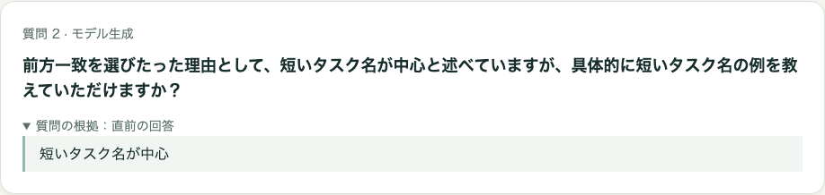
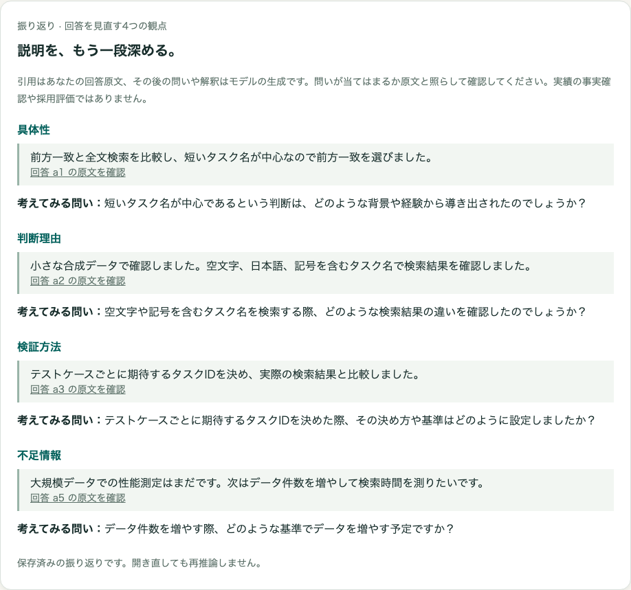
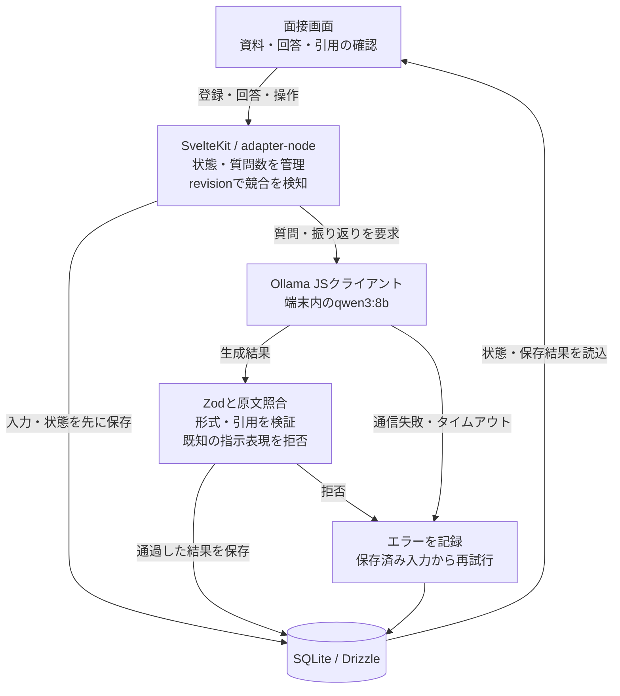

# Private Interview Coach

**ローカルLLMの深掘り質問を、原文の引用・状態管理・保存・実測で確かめる。**

職務経歴や開発記録を入力すると、ローカルLLMが回答に合わせて質問を深掘りする、個人用のテキスト模擬面接アプリです。

**開発段階：合成データで検証した技術プロトタイプ。** 資料登録から5問の面接、振り返り、保存・再表示まで動作します。面接練習としての有用性は、まだ人による評価を行っていません。実装リポジトリは非公開です。

| 項目         | 内容                                                                                                          |
| ------------ | ------------------------------------------------------------------------------------------------------------- |
| 開発形態     | Codexによる実装・テスト・点検支援を活用した個人開発                                                           |
| 現在の範囲   | 端末内・1利用者向けのテキスト模擬面接MVP。生成品質は継続評価中                                                |
| 技術         | SvelteKit / TypeScript / adapter-node / Tailwind CSS、SQLite / Drizzle、Ollama公式JavaScriptクライアント、Zod |
| 実モデル     | qwen3:8b。取得後の外部通信禁止下でも生成・保存を確認                                                          |
| 検証         | Vitest、Playwright、GitHub Actions、実モデルによる合成ケース評価                                              |
| 公開するもの | 設計判断、合成入力から実生成した画面、試行結果と限界                                                          |

## 解決したい課題

経歴に書いた成果を、面接で「自分の行動」「選んだ理由」「確かめた方法」まで説明するには練習が必要です。固定の質問集だけでは回答に応じた追加質問を受けにくく、経歴の原文を外部サービスへ送ることにも抵抗があります。

そこで、端末内のモデルが直前の回答を根拠に深掘りし、原文を見ながら説明を振り返れる体験を作りました。採用可能性や人物の優劣は採点しません。

## できること

1. 短い職務経歴・開発記録を登録する。
2. 資料を引用した初問に答え、回答を引用した深掘りを受ける。
3. 最大5問、または回答済みのところで終了する。途中の中断・再開も可能。
4. 具体性・判断理由・検証方法・不足情報の4観点から、引用付きの確認質問を読む。
5. 保存した資料・対話・振り返りを、再推論せず開き直す。

## 合成デモ

以下は2026-10-03に、架空の「タスク管理アプリの検索画面開発」を入力し、qwen3:8bで実際に生成した画面です。実際の職務経歴・顧客情報は含みません。回答も評価用の合成文章です。表示された質問・振り返りの文章は画像作成時に差し替えていません。

_深掘り質問の根拠を展開して確認できる。引用の一致はアプリ側で検証する。「選びたった」という不自然な日本語も、実出力のまま掲載している。_

_引用リンクで元の回答全文へ移動できる。確認質問はモデルの生成であり、事実認定や能力評価ではない。「判断理由」が検証内容を取り上げるという、観点との対応の弱さも残っている。_

## 構成

TypeScript、Svelte 5、Tailwind CSS、better-sqlite3、pnpmを使用しています。アプリとOllamaはloopback接続に限定し、クラウドへのフォールバックは実装していません。認証付き公開サービスではなく、1端末・1利用者・1アプリプロセスを前提にしています。

## 設計で重視したこと

**根拠を分ける。** 初問には資料、深掘りには直前の回答、振り返りには回答群だけを渡します。資料にあった文章を「回答したこと」と取り違えた実モデルの失敗を受けた設計です。生成物には原文引用を必須にし、回答IDと文字列の一致を検証します。既知の操作指示・採点表現を含む出力も表示前に拒否しますが、言い換えを含めた完全な検知ではありません。ただし、引用が正しくても質問の前提が正しいとは限りません。

**モデルに状態管理を任せない。** 質問数と状態はアプリ側で管理します。回答を保存してから生成し、revisionで二重送信と古い結果を拒否します。中断後の遅延結果、タイムアウト、保存失敗を成功として表示しません。保存済みの再表示にLLMは不要です。

**説明不足を断定しない。** 初期の振り返りは、すでに説明した内容を「不足」と指摘しました。そこで自由な評価文を、回答の引用と中立な確認質問へ変更しました。過去の保存結果は変換せず、旧形式として表示します。

**省略を見えるようにする。** 資料は6,000文字、回答は1,200文字まで保存します。推論では資料の先頭2,400文字、各回答の先頭800文字を使い、省略する末尾を送信前に確認できます。要約を原文の根拠として代用しません。直前回答だけを使うため指示語や過去の文脈を追う力には制約があります。

## 検証と限界

2026-10-03の紹介対象実装について、ローカル検証と同日に成功した製品CIを照合しました。記事掲載のためにアプリテストやモデル推論を追加実行した結果ではありません。

| 検証                     | 結果・対象                                                                                   |
| ------------------------ | -------------------------------------------------------------------------------------------- |
| Vitest                   | 34件成功。状態遷移、保存失敗、引用・既知表現の拒否、モデル接続確認、文脈の分離など           |
| Chromium E2E             | 9件成功。5問から再表示、中断・再開、旧保存形式、引用リンク、省略範囲、エラー時の入力保持など |
| 型検査・本番ビルド・整形 | 成功。ビルドには依存由来の既知警告が残る                                                     |
| 実モデル回帰             | 固定14ケース×2回。24回通過、命令混入の4回を表示前に拒否。全件成功とは扱わない                |
| 実ブラウザーと実モデル   | 5問・振り返り・保存、中断・再開、タイムアウトからの復旧を確認                                |
| モデル停止後の再表示     | アプリ再起動後も保存内容が一致。生成リクエスト0件                                            |

実モデル評価と、自動テストのOllama互換モックは分けています。[評価記録](evaluation.md)に条件・結果・失敗例を記載しています。モデル取得後、macOSのプロセス単位で外部通信を禁止し、端末内の生成・保存・再表示を確認しています。

質問の関連性、架空の実績の防止、4観点の有用性は、形式検証だけでは保証できません。同義の質問重複、長期の面接履歴、人による実用評価、異なるハードウェアでの性能は今後の課題です。SQLiteは暗号化していません。実データを扱う場合の端末管理は別途必要です。

## 開発から得た学び

- 引用が原文と一致していても、質問の前提や振り返りの内容が正しいとは限らない。形式検証と意味の点検を別に記録する必要がある。
- プロンプトの注意書きを強めるだけでは、命令文の混入を防げなかった。既知の失敗を表示前に拒否する処理と、検知の限界を説明する仕組みを加えた。
- モデルの完了を待たずに回答を保存し、状態をアプリ側で管理すると、中断・失敗・再表示を生成品質から切り離して扱える。

## 担当範囲とAI利用

個人プロジェクトとして、ローカルLLM必須、回答に応じた深掘り、原文との区別、人物採点を行わないこと、並行開発環境を保護することを要件として指定しました。

設計案、実装、自動テスト、評価スクリプト、公開資料の作成にはCodexの支援を使用しています。実モデル出力の内容点検にもAI支援を使っています。人による独立したレビュー、実利用での有用性や面接対策の効果は未検証です。

[ポートフォリオの一覧へ戻る](../../README.md)
