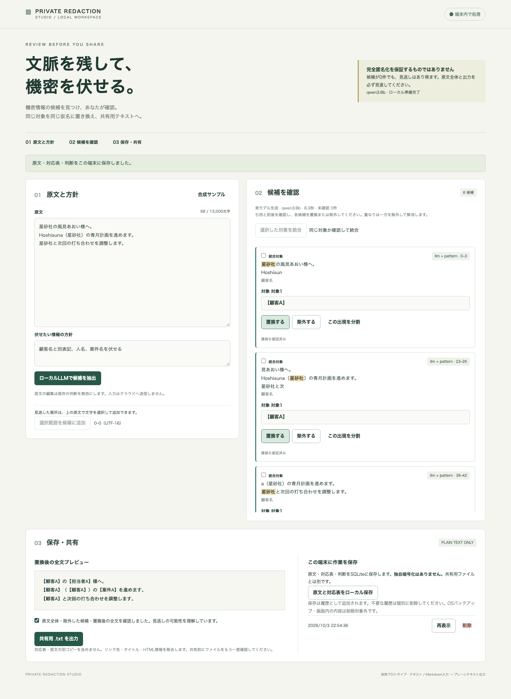

# Private Redaction Studio — 原文を確かめて、機密を仮名に置き換える

文書共有前に、端末内のLLMが機密情報の候補を抽出し、利用者が確認・修正して共有用テキストを作る技術プロトタイプです。SvelteKit / TypeScript、Ollama、SQLiteを使い、原文の範囲・版との照合、同一対象の別表記、保存データと共有出力の分離に取り組みました。

確認日：2026年10月4日。紹介対象は `889205b` の実装です。実モデルの主要操作と合成評価を確認していますが、公開情報を残す追加評価では過剰検出が多く、基準未達でした。完全匿名化、自動判断の正しさ、人の作業時間削減を実証した製品ではありません。実装コードは非公開で管理し、ここでは合成データの画面と設計・検証結果を紹介します。

## 解決したい課題

共有前の文書では、同じ顧客が日本語名・英語名・略称で何度も登場します。一方、同じ名前でも別人の場合があります。Markdownには、表示文だけでは気づきにくいリンク先・タイトル・コメントも含まれます。

モデルに文章全体を書き直させると、どの原文を変えたか追いにくくなります。このアプリでは、モデルは原文の引用を候補として返し、利用者が出現ごとに判断します。アプリは確認済みの範囲と仮名から共有文を組み立てます。

## 操作の流れと実生成デモ

1. テキストまたはMarkdownと、伏せたい情報の方針を入力する。
2. ローカルLLMとパターン検出が候補を抽出する。原文の位置・引用・理由・検出元を確認する。
3. 見逃しは原文を選択して追加し、不要な候補は除外する。別表記の統合、出現単位の分割、仮名編集を行う。
4. 置換後の全文を確認し、共有用のプレーンテキストを出力する。
5. 作業を続ける場合は原文・対応表・判断を端末内に保存し、後から再表示する。

次は、**実際のローカルqwen3:8bで生成した候補を確認・統合し、共有用の仮名へ修正した画面**です。「星砂社」「風見あおい」「青月計画」は架空です。候補の応答差し替えはなく、確認・編集・撮影をAIスクリプトが担当しました。本人の操作評価ではありません。

- [実生成直後の候補](images/01-candidates.png)：6候補、8.33秒。未確認の状態では共有出力できない。
- [確認・統合・仮名修正後](images/02-reviewed-output.png)：顧客の4出現を同じ仮名に置換し、保存した状態。
- [保存済み結果の再表示](images/03-saved-replay.png)：新しい推論ではない。最終確認チェックはリセットされる。
- [実際にダウンロードした共有テキスト](shared-example.txt)：170 bytes。原文の別コピーと対応表を含まない。

撮影は2026年10月3日、対象 `6a8f7ec`。アプリ・Ollama・ブラウザを対象プロセスの外部通信禁止下で動かし、生成・修正・出力・保存・再表示・削除を確認しました。共有ファイルを期待する全文と比較し、一致を確認しました。画像はこの実生成デモ時点のものです。その後の同表記の除外・参照ID除去の修正は、後述の別の回帰検証で確認しています。

## 構成と技術選定

処理は「原文・方針 → 端末内の候補抽出 → 原文照合 → 利用者の確認・修正 → 仮名置換・メタデータ除去 → 共有テキスト」の順です。確認した判断は、共有出力とは別にSQLiteへ保存します。

| 技術・処理 | 役割と選定理由 |
| --- | --- |
| SvelteKit / TypeScript / Tailwind CSS | 原文、候補、出力を並べ、判断の状態を示す。Nodeアダプターで端末内起動する。 |
| Ollama / qwen3:8b | 文書から機密候補を抽出する。クラウドへのフォールバックは設けない。 |
| Zod / JSON Schema / 原文照合 | 応答形式を検証したうえで、引用が原文に存在するか確認する。形式成功と意味の正しさを区別する。 |
| CommonMarkの構文解析 | Markdownのリンク先・タイトル・参照ID・定義・HTML情報を共有出力から除去する。 |
| SQLite / Drizzle | 原文・対応表・判断を保存し、再推論せず再表示する。共有ファイルには同梱しない。 |

### 候補を原文の範囲と版に結び付ける

モデルが返す位置情報をそのまま採用せず、引用の完全一致からUTF-16の範囲を求めます。存在しない引用は棄却します。同一表記の全出現を初期候補にし、別表記や同名別人は利用者が統合・分割して確認します。

原文を編集すると古い版の判断を無効にします。未確認候補、範囲の重なり、古い版、既知の残留があると共有出力できません。仮名の変更や判断の変更後にも最終確認を要求します。

### 原文と対応表を共有ファイルに混ぜない

ローカル保存には原文と対応表が残り、独自暗号化はありません。その事実を画面で示します。共有用はプレーンテキストに限定し、原文の未変更部分と確認済みの仮名から構成します。

リンク先・タイトル・参照ID・HTML情報を除去した後、承認した引用やURLなどの残留を検査します。ただし、機密と同表記の一般語は、その原文範囲を明示除外すれば保持できます。除外許可を別の出現や仮名の文字列へ流用しないよう、出力文字と元の位置の対応を追跡します。

## 実モデル評価と改善の判断

以下は全てAI作成の合成データによる評価です。独立ケースは指示調整に使う前に固定し、初回結果を記録しましたが、別の人が用意したベンチマークではありません。検出指標は修正前の候補で、出力契約は正解を知るAIが候補を修正した後に測っています。

| 対象・確認日 | 結果 | 対象コミット・限界 |
| --- | --- | --- |
| 初期の固定4件・独立3件、10月3日 | 改善後の機密文字recall/precisionは両集合とも100%。独立3件は12/12出現 | 改善 `91b20fd`、独立実測 `773ff86`。少数合成文書の結果 |
| 難例16原型、10月3日 | 604/604機密文字、62/62出現、precision604/667 = 90.55% | `f600811`。約1万文字、同名別人、難読化連絡先、表・コード・隠れたメタデータを含む |
| 同難例の7変形・1反復、10月3日 | 264/264機密文字、34/34出現、precision264/318 = 83.02% | 同上。全24呼び出しは23種類の入力であり、24独立文書ではない |
| 公開情報を残す未使用8件、10月4日 | 43/43機密文字、10/10出現、precision43/75 = 57.33% | `874d96e`。基準85%に未達。公開情報の6候補を除外する必要があった |

precisionは、指定された正解の置換範囲に対する文字単位の適合率です。難例では、出力処理で消えるメタデータのタイトルを候補化した部分も正解範囲外として数えます。すべてを同じ意味の過剰検出とは扱いません。一方、未使用8件では公開著者・作品名・公開組織の別表記を余計に候補化し、実際に除外が必要でした。候補0件も完全匿名化の保証にはなりません。

過剰検出を減らすために指示を詳しくした候補も比較しました。しかし難例原型の検出が62/62から60/62出現、precisionが90.55%から89.47%へ悪化したため、不採用にしました（10月4日、`712bcb9`）。旧指示を維持する判断を記録してから、上表の未使用8件を実行しています。失敗した正解や基準を書き換えていません。

### 出力処理で見つかった失敗

難例の初回は、機密と同じ表記の一般語まで残留検査で拒否し、正解参照修正後でも出力は22/24でした。原文位置に結び付いた明示除外を実装し、保存済みの実モデル応答を使う出力回帰で24/24へ改善しました（`a6a7afd`）。新しいモデル推論による検出改善ではありません。

さらに、Markdownの参照リンクで宛先を消しても非表示IDが残る失敗を再現し、表示文だけを残す処理へ修正しました（`6855bed`）。保存応答24件は全出力契約に成功し、以前の成功20件は不変、参照リンク2件はIDだけを除去、同表記の2件は修正後の成功を維持しました。実ダウンロードの内容もブラウザテストで確認しました。

### 速度・メモリと復旧

実測環境はmacOS 27.0.1、Apple M6、物理32 GiB、Node 22.23.3、Ollama 0.34.4、qwen3:8b / Q4_K_M。temperature 0、seed 42、think false、context 16,384、最大出力2,400で評価しました。

難例原型の中央値は8.108秒、10,763 UTF-16単位の長文は38.179秒、専用Ollamaと子孫プロセスのRSS最大は8.79 GiBでした（10月3日、`f600811`）。RSSは0.5秒間隔の合計で、GPUメモリを独立に測った総消費ではありません。各ケース1回で、一般的な性能保証には使いません。

10月4日、`491e2ff` で実推論中断後の再試行、同時要求の拒否、専用推論サービスの停止・再起動、実SQLiteへの制御した書き込み障害からの再保存、アプリ再起動後の再表示・削除を確認しました。実ディスク枯渇やGPU内部の停止時刻を測ったものではありません。

## 自動検証と残る制約

10月4日、最終コード `874d96e` で型検査、評価器のstrict TypeScript検査、build、単体38件、ブラウザ6件、保存済み実モデル応答の出力回帰24件・旧7件が成功しました。ブラウザ6件の推論はモックで、実モデル評価とは別です。最終統合 `889205b` は検証・点検した変更を含み、以後の変更は結果と文書です。

製品のホストCIは利用制限で開始できておらず、ローカル成功をCI成功とは扱いません。本人の指示でCI成功待ちを解除して統合しました。この公開資料リポジトリにはCIを導入していません。

現在の制約は、モデルの見逃し・過剰検出、同名別人の判断、別表記の統合、利用者自身の確認漏れです。画像altや文字参照など、元の位置を確定できない変換では保守的に出力を拒否する場合があります。未定義の角括弧は通常本文として保持するため、本文自体の確認も必要です。

入力は12,000 UTF-16単位までです。PDF・Word・画像OCR、複数利用者、公開サーバー運用は対象外です。未保存作業はリロードで消え、保存データの削除もOSバックアップや物理復元不能を保証しません。人の有用性・時間短縮は未評価であり、確認・修正を前提とする技術プロトタイプとして紹介します。

## 担当範囲と学び

本人は課題・要件・技術方針・開発運用・掲載基準と公開の判断を担当しました。AI支援は設計、実装、合成データ作成、検証実行、差分の自己点検、操作デモと記事作成を担当しました。本人による操作評価・意味品質の採点、独立した第三者のレビューは未実施です。

この開発では、候補の抽出精度だけでなく、原文に結び付いた判断と共有ファイルの検証を別々に設計する必要がありました。また、指示を詳しくする案が見逃しを増やしたため、事前基準を満たさない変更を採用しない判断も成果の一部としています。

[プロジェクト一覧へ戻る](../../README.md)
