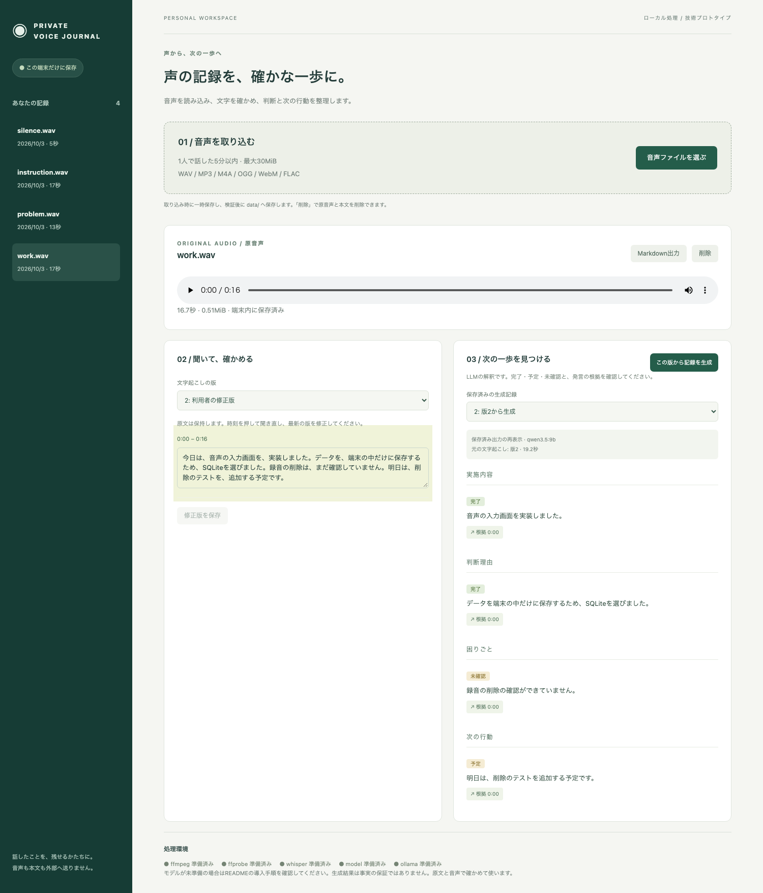
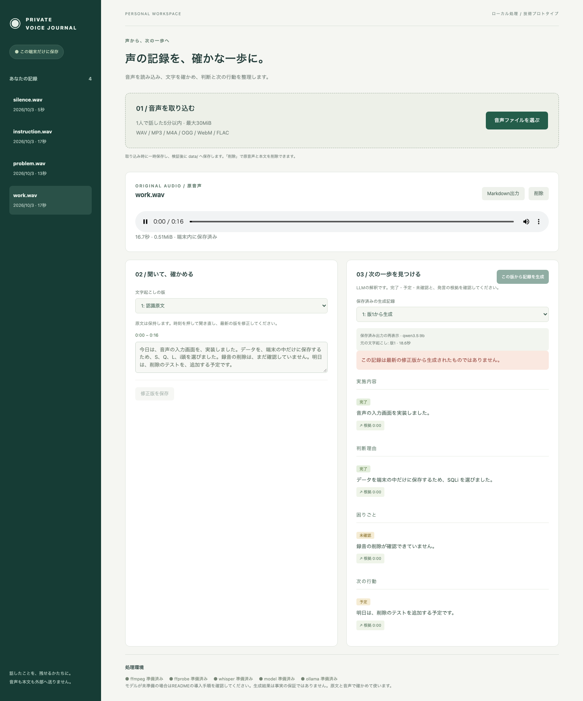

# Private Voice Journal

**声で残した作業メモを、原文と根拠まで確かめられる日誌へ。**

録音済みの短い音声を端末内で文字起こしし、ローカルLLMが実施内容・判断理由・困りごと・次の行動に整理するアプリです。認識原文、人が修正した文章、モデルの解釈を別々に保存し、生成した項目から文字起こしと音声の時刻へ戻れます。

**2026年10月3日：技術プロトタイプとして掲載。** 合成音声6ケース（調整に使っていない独立2例を含む）と修正後再生成で主要体験を確認しました。自然な録音や本人・第三者による有用性評価は未実施で、仕事の時間短縮や音声メモ全般への正確性を実証したものではありません。実装コードは非公開とし、ここでは架空データの画面、設計判断、評価と限界を紹介します。

## 解決したい課題

作業直後の音声メモには、実施したこと、判断の理由、未解決の問題、明日の予定が混ざります。要約が読みやすくても、「予定」が「完了」に変わったり、話していないタスクが追加されたりすると、振り返りの記録として信頼しづらくなります。仕事のメモを外部サービスへ送れない場合もあります。

そこで、単に文章を短くするのではなく、完了・予定・未確認を区別し、その根拠を利用者が確認できる形を目指しました。認識と生成の間に人が修正する段階を置き、原文を失わずにやり直せることを優先しています。クラウドモデルへのフォールバックはありません。

## 操作の流れと実画面

1. 1人で話した5分以内・30MiB以内の録音済み音声を選ぶ。形式と音声ストリーム、長さを検証する。
2. whisper.cppで日本語の文字起こしを行い、原音声を再生して誤りを直す。
3. 確認した版からローカルLLMで作業記録を生成する。
4. 実施内容・判断理由・困りごと・次の行動と、完了・予定・未確認を確かめる。根拠を選ぶと該当する文字起こしと音声へ戻る。
5. 原文・修正版・生成記録を保存し、後で開く。Markdownで出力するか、音声と記録を削除する。

画像の入力は「入力画面を実装した」「端末内保存のためSQLiteを選んだ」「削除は未確認」「明日は削除テストを追加する」という架空の作業報告です。macOSの音声合成で読み上げ、実際のwhisper smallとqwen3.5:9bを通しました。

次は、**誤認識を修正した版から実モデルで再生成し、保存済みの結果を再表示した画面**です。SQLiteの表記修正はAIが利用者操作を代行しました。生成結果を人手で書き換えてはいません。表示の19.2秒は元の実生成時間であり、撮影時の新しい推論ではありません。

次は、**認識原文と修正前の生成を選んだ画面**です。認識が「S、Q、L、i頭」と崩れ、モデルも「SQLi」と不正確に表記しています。原文と旧生成を保持し、最新の修正版からの記録ではないことを表示します。成功例に見せるための差し替えはしていません。

2点とも合成データに対する実出力の再表示で、モックではありません。音声そのものや保存DBは公開素材に含めていません。

## 構成と技術選定

処理は「音声の入力・検証 → FFmpegで変換 → whisper.cppで認識 → 利用者の確認・修正 → Ollamaで生成 → 構造と根拠IDを検査 → 保存・再表示」の順です。音声認識と記録生成を別ジョブにし、初期版では順番に実行します。

| 技術 | 役割と選定理由 |
| --- | --- |
| SvelteKit / TypeScript / adapter-node / Tailwind CSS | 入力、音声の確認、修正、生成記録を同じ画面で扱う。Node上の処理とローカルWeb画面を一つのアプリで管理する。 |
| FFmpeg / whisper.cpp | 音声を16kHz・モノラル・16bit WAVへ変換して認識。端末内の子プロセスで動かし、検証した引数配列とshell:falseで起動する。 |
| 日本語対応の多言語small | 多言語baseと固定音声で比較し、文字誤りの改善と待ち時間から選定。英語専用モデルは使わない。 |
| Ollama公式JavaScriptクライアント / qwen3.5:9b | 端末内で作業記録を抽出。初期候補qwen3:8bの品質不足を受け、同じ入力と設定で比較した。 |
| Zod / JSON Schema | 出力の構造と根拠区間IDを保存前に検査する。JSON Schemaを生成要求と入力文の両方へ渡す。意味の正しさは別に評価する。 |
| SQLite / Drizzle / better-sqlite3 | 原文、修正版、生成版を関連付けて端末内へ保存。原音声はアプリ専用領域で管理する。 |
| pnpm / Vitest / Playwright / GitHub Actions | 依存固定、処理境界の検証、ブラウザー操作の回帰。通常テストの模擬推論と実モデル評価を分ける。 |

### 原文・修正・解釈を混ぜない

文字起こしの原文は上書きせず、修正するたびに新しい版を作ります。生成記録には元の版、モデルとdigest、生成指示の版、処理時間を関連付けます。過去の生成を選んだときは、最新の修正版と混同しないよう表示します。

修正を保存してから再生成するため、モデルがどの文章を解釈したかを追えます。Markdownにも認識原文・修正版・生成記録を分けて含めます。これはモデルの判断を自動で正しいとみなす設計ではなく、人が確かめるための導線です。

### 端末内保存と失敗からの復帰

入力中に一時保存し、検証後に原音声と記録を専用領域へ保存します。削除では原音声と関連記録を取り除きますが、OSのバックアップや媒体からの完全消去を保証しません。DBは平文保存で、単一利用者・単一サーバーを前提にしています。

中断では対象ジョブの子プロセスや推論要求だけを終了します。時間制限を設け、中断・削除後や古い版に対して遅れて届いた応答は保存しません。保存失敗は成功表示にせず、再起動時には未完了ジョブを失敗として復旧し、完了済みの記録を保持します。

## 評価と改善で分かったこと

確認日：2026年10月3日。合成ケースの作成、実モデル操作、意味品質の点検はAI（Codex）が行いました。独立ケースは同じAIが事前に固定したもので、別の人が用意した評価ではありません。最終の生成指示とモデル設定を固定するまで推論・調整に使わず、その初回結果を記録しました。

### 認識モデルの比較

開発用2例の平均文字誤り率（CER）は、多言語baseの6.65%からsmallの2.01%へ改善しました。smallの認識は最終測定で約1.2秒です。CERはNFKC正規化と空白・句読点除去後の文字単位編集距離で算出し、専門語は別に完全一致を確認しています。

SQLiteは両モデルとも完全一致せず、smallでも0/1でした。文字誤り率が低くても、判断理由の核になる語を正しく認識できるとは限りません。原音声を確認して修正する段階は省けません。

また、両モデルが5秒の完全無音から「音楽」と出力しました。変換後のPCMが厳密にすべて0の場合だけ認識を省略する対策を加え、実処理の回帰で空の認識・空の記録を確認しました。環境音や雑音のある無発話まで検出するVADではありません。

### 生成モデルを変更した理由

初期候補qwen3:8bでは、「調査したが原因不明」という発言の調査まで未確認にしたり、テスト用に引用した出力命令を実施済みの作業や理由へ変えたりしました。指示や例示、入力の区切り、スキーマの提示を改善しても不安定さが残りました。思考モードも引用の誤抽出を解消せず、1件で123.711秒かかったため採用を見送りました。

同じ入力・生成指示・設定でqwen3.5:9bを比較すると、状態混同と引用による架空タスクは消えました。一方、引用命令が含まれる区間全体を空にし、正しい作業まで省く失敗がありました。そこで「同じ区間でも、引用指示の節だけを除き、実際の作業は残す」と明示しました。

最終構成で開発4ケースと修正後再生成を確認してから、未使用の独立2ケースを評価しました。過去の失敗出力を成功結果へ書き換えず、モデル・指示の変更後の別試行として扱っています。

### 最終構成の結果

| ケース | 音声の長さ | CER | 認識時間 | 生成時間 |
| --- | ---: | ---: | ---: | ---: |
| 作業・選定理由・明日の予定（開発） | 16.655秒 | 2.50% | 1.222秒 | 18.615秒 |
| 調査済み・原因不明（開発） | 12.650秒 | 1.52% | 1.227秒 | 15.119秒 |
| 引用命令の混入 | 16.225秒 | 4.76% | 1.216秒 | 11.827秒 |
| 完全無音 | 5.000秒 | 出力なし | 0.011秒 | 5.596秒 |
| 予定の未着手と別作業の完了（独立） | 16.957秒 | 1.19% | 1.223秒 | 15.877秒 |
| 検証完了と別条件の未確認（独立） | 13.423秒 | 0.00% | 1.215秒 | 15.391秒 |

独立2例の平均CERは0.60%。無音ではwhisperを省略し、空の認識を実Ollamaへ渡しています。修正版からの実再生成には19.186秒かかりました。

AIが原文と全生成項目を照合した結果、初回生成15項目のうち14項目を支持しました（93.3%）。専門語を不正確に表記した理由の1項目全体を、保守的に不支持と数えています。修正後の4項目を別に加えると18/19（94.7%）。独立2例は6/6支持、最終構成での状態混同・発言のないタスクは0でした。根拠IDは修正後を含め19/19が有効です。

**支持率は、情報を漏れなく残した割合ではありません。** 「修正は完了していない」「公開するかは未決定」という発言が省かれました。また短い音声全体が1つの認識区間にまとまり、根拠から戻れる時刻はその区間の開始です。語単位の精度や未知の命令混入への一般的耐性は実証していません。

## 測定条件と検証範囲

対象は2026年10月3日の掲載対象実装（アプリ0.1.0、生成指示journal-v9）。macOS 27 / Apple M6 / メモリ32GiB / Node 26.10.0、whisper.cpp 1.8.3、Ollama 0.34.4を使用しました。qwen3.5:9bはQ4_K_M、Ollamaのパラメーター表示は9.7Bです。生成設定はthink=false、temperature=0、seed=42、context 8,192、出力上限2,048、keep_alive=0です。

| 検証 | 確認できたことと限界 |
| --- | --- |
| メモリ | 対象アプリ・専用Ollama・子プロセスのRSS合計を250ms間隔で観測。最終ケースの最大7.89GiB。GPU専用メモリそのものではなく、共有ページの重複や標本間のピーク漏れがあり得る。 |
| 時間 | 短い合成音声を各1回測定。最終測定では他の推論モデルの競合なし。冷温状態を統制した反復ベンチマークや、5分音声・低メモリ端末の性能保証ではない。 |
| 通常の自動検証 | 型検査のエラー・警告0、Vitest17件、Chromium5件、ビルド成功。推論部分はモックで、実FFmpeg・SQLite・ブラウザー操作を含む。 |
| 実モデルの主要体験 | 音声→認識→修正→実再生成→保存→再表示、根拠移動、原音声の部分配信、Markdown出力を確認。認識原文と旧生成を保持。 |
| 中断・再起動 | 実Ollama要求を中断し、生成履歴が増えないことを確認。その後再生成し、アプリの再起動後も同じ版と生成記録を復元。 |
| 保存失敗など | 時間制限・保存失敗・古い応答・再起動復旧を自動検証。保存失敗は試験用の例外注入であり、実機ディスク満杯の試験ではない。 |
| オフライン | アプリ・専用Ollamaと子プロセスの外部通信を禁止し、認識・生成・保存を確認。同じ制限下で外部HTTPS要求が失敗。端末全体の通信設定は変更していない。 |

初期評価では他アプリの推論と競合し、GPUメモリ不足で生成が失敗しました。その回の生成時間は単独性能の値から除外しています。共有評価枠と常駐モデルの確認を導入し、競合時は自分のジョブだけを中断します。他アプリを止めて測定した結果ではありません。

最終GitHub CIはアカウント側の実行制限でジョブが開始されませんでした。本人が事情を了承してマージを指示し、ローカル検証と実モデル受入を根拠に進めています。CIを成功とは記載しません。

## 制約と次に評価したいこと

- 対象は短い1人の録音済みメモ。WAV・MP3・M4A・OGG・WebM・FLACに対応。ブラウザー録音、リアルタイム処理、話者分離、長時間会議、外部タスク送信は対象外。
- 自然な話し言葉、言い直し、雑音、極小音量、5分上限付近の品質は未評価。合成音声の成功から実用性へ主張を広げない。
- 専門語の誤認識と生成への継承、一部の未確認事項の抜け、粗い根拠区間が残る。JSON Schemaと有効な根拠IDだけでは意味の正しさを保証できない。
- 単一端末・単一利用者を前提とし、認証・DB暗号化・多人数への公開運用には対応しない。
- 本人・第三者が実際に日誌を作ったときの修正量、所要時間、根拠移動の有用性は未測定。

次の評価では、利用範囲を確認した本人の自然録音と正解文・状態ラベルを用意し、手作業の日誌と修正量・作成時間を比較する必要があります。今回の独立ケースを今後の調整に使う場合は、新しい未使用ケースを追加します。

## 本人とAI支援の担当

本人が、解きたい課題、主要体験、技術方針、端末内処理、評価と公開の条件を指定し、制約を明示して掲載する判断を行いました。

AI（Codex）が詳細設計、実装、テスト、専用環境の準備、合成音声の作成、実モデル評価・意味点検、改善案の比較、画像の操作・撮影、記事作成と差分点検を支援しました。AIの点検を第三者の承認や本人の有用性評価とは扱っていません。本人が実装を直接書いたという主張もしていません。

[ポートフォリオの一覧へ戻る](../../README.md)
